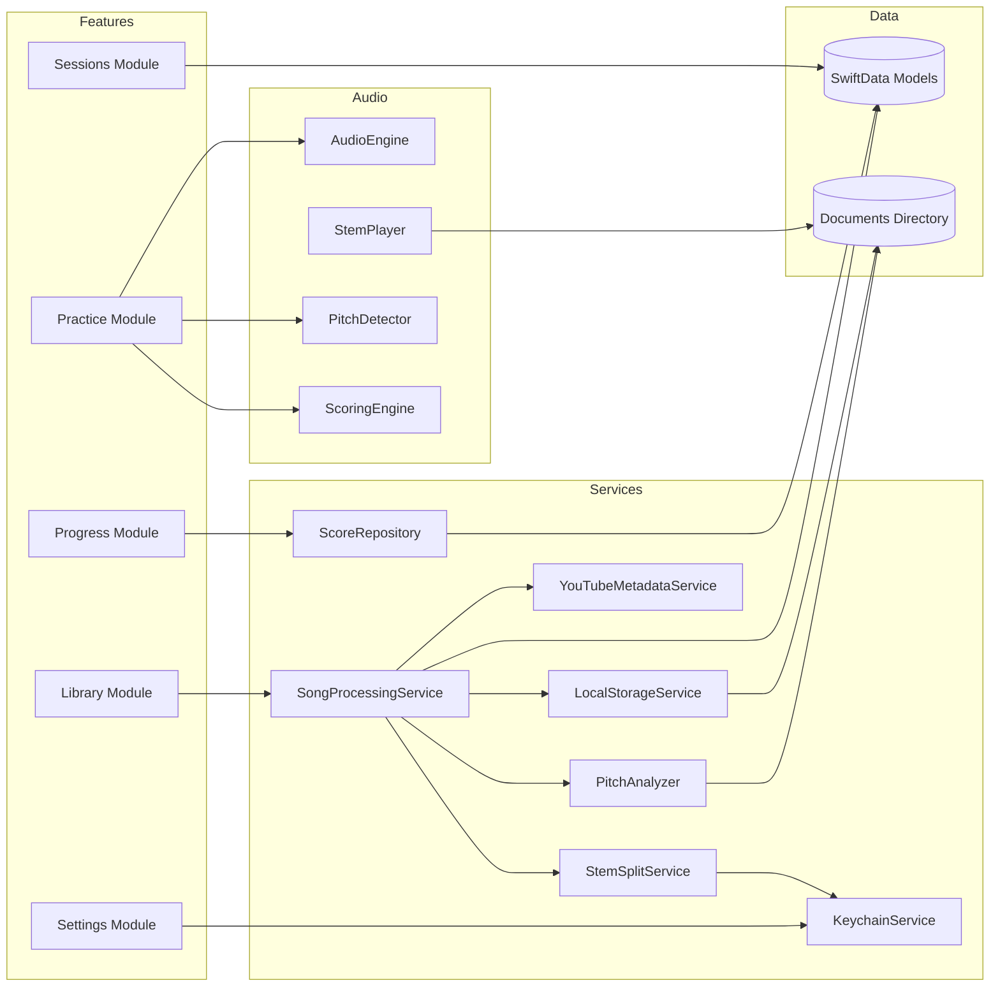

# IntonavioLocal — System Architecture

## System Architecture

High-level view of all components and how they interact. Everything runs on-device except two external API calls.

```mermaid
graph TD
    subgraph iOS/macOS App
        UI[SwiftUI Views]
        VM[ViewModels<br/>@Observable]
        Services[Services<br/>Processing, Storage, Pitch]
        Audio[AudioEngine<br/>AVAudioEngine]
        SD[(SwiftData<br/>Songs, Stems, Sessions, Scores)]
        FS[(Documents Directory<br/>Stem files, Pitch JSON)]
        KC[(Keychain<br/>API Key)]
    end

    subgraph External Services
        YT[YouTube IFrame API]
        SS[StemSplit API]
        OE[YouTube oEmbed API]
    end

    UI --> VM
    VM --> Services
    VM --> Audio
    Services --> SD
    Services --> FS
    Services --> KC
    Services --> SS
    Services --> OE
    UI --> YT
    Audio --> FS
```

## Component Diagram

Detailed view of the app's internal modules and their connections.



## Technology Stack

| Layer                | Technology                       | Purpose                                                       |
| -------------------- | -------------------------------- | ------------------------------------------------------------- |
| **iOS/macOS Client** | SwiftUI, AVAudioEngine, WKWebView | UI, stem playback + pitch detection, YouTube video display    |
| **Data Storage**     | SwiftData                        | Songs, stems, sessions, score records                         |
| **File Storage**     | Documents directory              | Stem audio files (MP3), pitch reference data (JSON)           |
| **Secret Storage**   | Keychain                         | StemSplit API key (user-provided)                             |
| **Pitch Analysis**   | YIN algorithm (Accelerate/vDSP)  | On-device reference pitch extraction from vocal stem          |
| **Stem Separation**  | StemSplit API                    | External service for audio source separation (user's API key) |
| **Metadata**         | YouTube oEmbed API               | Song title, artist, thumbnail URL                             |
| **Build**            | XcodeGen (`project.yml`)         | Xcode project generation                                      |

## Data Flow Summary

1. **Song submission**: User pastes YouTube URL -> app extracts videoId -> fetches metadata via YouTube oEmbed -> creates SongModel in SwiftData (status: queued)
2. **Stem separation**: SongProcessingService calls StemSplit API directly -> polls for completion every 15s -> downloads stems in parallel -> saves to `Documents/stems/{songId}/`
3. **Pitch analysis**: After stems are saved -> PitchAnalyzer runs on-device YIN extraction on vocal stem -> saves pitch data JSON to `Documents/pitch/{songId}/reference.json`
4. **Practice session**: App loads stems from Documents directory -> plays stems via shared AudioEngine (YouTube muted, video-only) -> detects singer pitch via mic on same engine (AEC cancels stem audio) -> compares against reference -> displays on piano roll
5. **Session save**: Session summary (timestamped pitch data, score) saved to SwiftData locally

## Architecture Rules

### On-Device First

Everything runs locally. The only network calls are:

- **StemSplit API** — stem separation (requires user-provided API key)
- **YouTube oEmbed API** — song metadata (title, artist, thumbnail)
- **YouTube IFrame API** — video playback in WKWebView

No backend server, no user accounts, no cloud storage, no sync.

### Dependency Direction

```
Views -> ViewModels -> Services -> Data (SwiftData, Documents, Keychain)
                                -> External APIs (StemSplit, YouTube oEmbed)
```

- Views are declarative renderers of ViewModel state.
- ViewModels orchestrate user actions and hold observable state.
- Services encapsulate data access and external API calls.
- Data layer (SwiftData, file system, Keychain) is accessed only through services.

### External Service Isolation

Each external service is wrapped behind a dedicated service enum/struct. Business logic never makes direct URLSession calls.

| External Service   | Wrapper                    | Purpose                                      |
| ------------------ | -------------------------- | -------------------------------------------- |
| StemSplit API      | `StemSplitService`         | Job creation, status polling, stem download  |
| YouTube oEmbed API | `YouTubeMetadataService`   | Title, artist, thumbnail resolution          |
| YouTube IFrame API | `VideoPlayerProtocol`      | Video playback abstraction                   |
| Keychain           | `KeychainService`          | Secure API key storage                       |

### Storage Boundaries

Each storage layer has a clear purpose.

| Store                    | What goes in it                                   | What does NOT go in it                 |
| ------------------------ | ------------------------------------------------- | -------------------------------------- |
| **SwiftData**            | Song metadata, stem metadata, sessions, scores    | Audio files, pitch frame arrays        |
| **Documents directory**  | Stem audio files (MP3), pitch data JSON           | Relational data, session metadata      |
| **Keychain**             | StemSplit API key                                  | User data, preferences                 |

Recovery rule: if Documents is cleared, songs need reprocessing but no metadata is lost (SwiftData has it). If SwiftData is wiped, all data is lost.

### State Ownership

Every piece of state has exactly one source of truth:

| State                   | Owner                                              | Consumers                          |
| ----------------------- | -------------------------------------------------- | ---------------------------------- |
| Song processing status  | SwiftData `SongModel.status`                       | ViewModels observe via SwiftData   |
| Stem files              | Documents directory `stems/{songId}/`               | StemPlayer reads from disk         |
| Pitch reference data    | Documents directory `pitch/{songId}/reference.json` | ReferencePitchStore loads at practice start |
| Score history           | SwiftData `ScoreRecord`                            | ScoreRepository reads for display  |
| API key                 | Keychain                                            | StemSplitService reads per request |
| Practice sessions       | SwiftData `SessionModel`                           | SessionsViewModel reads for list   |

### Error Propagation

Errors flow forward, never silently swallowed:

```
Processing step fails -> SongModel.status set to FAILED
                      -> SongModel.errorMessage set with description
                      -> UI shows "Processing failed, tap to retry"
```

- **SongProcessingService**: catches errors, logs with context via AppLogger, sets FAILED status with descriptive message.
- **ViewModels**: display error state for the specific resource that failed.
- **Retryable vs terminal**: transient errors (StemSplit timeout, network failure) can be retried by the user. Terminal errors (invalid YouTube URL) are shown with clear messaging.

### Client Architecture Rules

- Views are declarative — no side effects in `body`.
- ViewModels use `@Observable` macro and own all mutable state.
- `async/await` and `Task` for all async work. Cancel tasks when views disappear.
- Audio thread (`installTap` callback): no memory allocation, no locks, no UI updates. Dispatch results to main thread.
- One processing service (`SongProcessingService`) orchestrates the full pipeline — no scattered URLSession calls.
