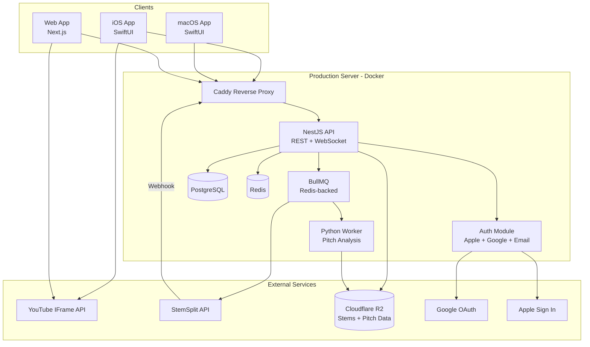
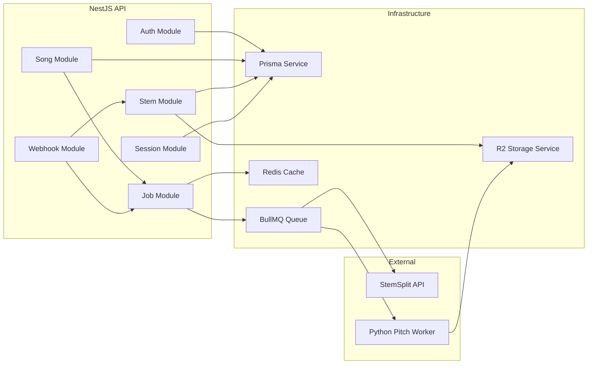

# Intonavio — System Architecture

## System Architecture

High-level view of all components and how they interact.



## Component Diagram

Detailed view of the NestJS backend modules and their connections.



## Technology Stack

| Layer                | Technology                                       | Purpose                                                                   |
| -------------------- | ------------------------------------------------ | ------------------------------------------------------------------------- |
| **iOS/macOS Client** | SwiftUI, AVAudioEngine (shared), WKWebView       | UI, stem playback + pitch detection on unified engine, YouTube video-only |
| **Web Client**       | Next.js 14, React, AudioWorklet                  | Web UI, browser-based pitch detection                                     |
| **API Server**       | NestJS, TypeScript                               | REST API, auth, job orchestration                                         |
| **Database**         | PostgreSQL 16 (Docker)                           | Users, songs, sessions, metadata                                          |
| **ORM**              | Prisma                                           | Type-safe database access                                                 |
| **Queue**            | BullMQ + Redis 7 (Docker)                        | Background job management                                                 |
| **Pitch Analysis**   | Python, librosa, pYIN                            | Server-side reference pitch extraction                                    |
| **Stem Separation**  | StemSplit API                                    | External service for audio source separation                              |
| **Object Storage**   | Cloudflare R2                                    | Stems (MP3/WAV), pitch data (JSON)                                        |
| **CDN**              | Cloudflare                                       | DNS, DDoS protection, R2 public access                                    |
| **Reverse Proxy**    | Caddy (Docker)                                   | TLS termination, routing                                                  |
| **Containerization** | Docker Compose                                   | All backend services on production VPS                                    |
| **Auth**             | Apple Sign In, Google OAuth, Email/Password, JWT | Multi-provider authentication                                             |
| **CI/CD**            | GitHub Actions                                   | Build, test, deploy                                                       |

## Data Flow Summary

1. **Song submission**: Client sends YouTube URL → API creates song record → enqueues StemSplit job
2. **Stem separation**: BullMQ triggers StemSplit API → StemSplit processes → webhook notifies API → stems downloaded and uploaded to R2
3. **Pitch analysis**: After stems are ready → Python worker extracts reference pitch from vocal stem → pitch data uploaded to R2 as JSON
4. **Practice session**: Client fetches stems + pitch data from R2 → plays stems via shared AudioEngine (YouTube muted, video-only) → detects singer pitch via mic on same engine (AEC cancels stem audio) → compares against reference → displays on piano roll
5. **Session save**: Client sends session summary (timestamped pitch data, score) → API stores in PostgreSQL

## Architecture Rules

### Dependency Direction

```
Clients (iOS, Web) → API → Services → Infrastructure (DB, R2, Redis, Queue)
                                    → External APIs (StemSplit, Apple)
```

- Dependencies point inward. Infrastructure never imports from services, services never import from controllers.
- Clients never talk to infrastructure directly. No direct R2 access, no direct DB queries. Always through the API. Presigned URLs are the one exception — API generates them, client uses them.
- Workers are standalone. The Python pitch worker reads from Redis (queue) and writes to R2 + PostgreSQL. It never calls the NestJS API.

### External Service Isolation

Every external service is wrapped behind an interface/adapter. Business logic never imports `@aws-sdk/client-s3` or a StemSplit client directly — only the adapter does.

| External Service   | Wrapper                       | Swap Scenario                                                           |
| ------------------ | ----------------------------- | ----------------------------------------------------------------------- |
| StemSplit API      | `StemSplitService`            | Self-hosted Demucs if StemSplit dies or pricing changes                 |
| Cloudflare R2      | `StorageService`              | Switch to S3 or MinIO without touching business logic                   |
| Apple Sign In      | `AuthProviderService`         | Already supports Apple, Google, and Email — add more via same interface |
| Google OAuth       | `AuthProviderService`         | Same adapter pattern as Apple                                           |
| YouTube IFrame API | `VideoPlayerProtocol` (Swift) | Support Vimeo or self-hosted video                                      |

### Storage Boundaries

Each storage layer has a clear purpose. Don't mix them.

| Store          | What goes in it                                                                    | What does NOT go in it                                                 |
| -------------- | ---------------------------------------------------------------------------------- | ---------------------------------------------------------------------- |
| **PostgreSQL** | User records, song metadata, session metadata, exercise definitions, relationships | Audio files, pitch frame arrays (too large)                            |
| **R2**         | Stem audio files, pitch data JSON                                                  | Relational data, user records                                          |
| **Redis**      | Job queue state, short-lived cache (song status polling, rate limits)              | Permanent data — anything in Redis must be rebuildable from PostgreSQL |

Disaster recovery rule: if Redis is wiped, the system recovers. If PostgreSQL is wiped, data is lost. If R2 is wiped, songs need reprocessing but no user data is lost.

### State Ownership

Every piece of state has exactly one source of truth:

| State                   | Owner                        | Consumers                                             |
| ----------------------- | ---------------------------- | ----------------------------------------------------- |
| Song processing status  | PostgreSQL `song.status`     | API reads from DB, clients poll API                   |
| Job position in queue   | BullMQ (Redis)               | API reads for ETA estimates                           |
| Stem files              | R2                           | Clients download via presigned URL                    |
| Pitch reference data    | R2                           | Clients download, API generates URL                   |
| User session (auth)     | JWT token (stateless)        | API validates, clients store                          |
| Auth credentials        | PostgreSQL `AuthProvider`    | Password hashes (EMAIL), provider IDs (APPLE/GOOGLE)  |
| Song library membership | PostgreSQL `UserSongLibrary` | API reads for user's library, clients display library |

Never cache state in a second location and treat the cache as authoritative. If you cache `song.status` in Redis for faster polling, the DB remains the source of truth — stale cache must never cause wrong behavior.

### Error Propagation

Errors flow forward, never silently swallowed:

```
Worker fails → Job marked FAILED in DB → song.errorMessage set
                                        → Client sees FAILED on next poll
                                        → User sees "Processing failed, tap to retry"
```

- **Workers**: catch, log with context, set FAILED status with descriptive message, move on. Never crash the worker process.
- **API**: return appropriate HTTP status. 4xx for client errors, 5xx for server errors. Never return 200 with an error body.
- **Clients**: display error state for the specific resource that failed. Never show a generic "something went wrong" without context.
- **Retryable vs terminal**: transient errors (StemSplit timeout) auto-retry 3x. Terminal errors (invalid YouTube URL) fail immediately, don't retry.

### API Contract Rules

- Versioned via URL prefix: `/v1/songs`, `/v2/songs`. No header-based versioning.
- Additive changes only within a version: new optional fields are fine. Removing fields or changing types requires a new version.
- Clients must ignore unknown fields (forward-compatible). API can add fields without breaking older clients.
- Pagination on all list endpoints: `?page=1&limit=20` from day one. No unbounded queries.
- Consistent ID format: CUIDs generated by Prisma (`@default(cuid())`). No type prefix — resource type is always clear from the endpoint context.

### Module Boundary Rules (NestJS)

- One module = one domain aggregate. `SongsModule` owns songs and library membership. `StemsModule` owns stems and presigned URLs. `SessionsModule` owns practice sessions. `JobsModule` owns BullMQ producers and processors. `StorageModule` owns R2 interactions. `HealthModule` owns health checks.
- Cross-module communication via exported services only. `SongsModule` imports `JobsModule` (for enqueuing stem-split). `WebhooksModule` imports `StemsModule` and `JobsModule`. Never import a repository or entity from another module directly.
- No circular dependencies. If A needs B and B needs A, extract the shared concern into a new module C.
- Webhook module is a thin router. It validates the payload with `WebhookSecretGuard` (HMAC-SHA256 via `X-Webhook-Signature` header) and delegates to `WebhooksService`. No business logic in webhook handlers.
- `PrismaModule` and `ConfigModule` are global — available to all modules without explicit imports.

### Client Architecture Rules (iOS + Web)

- Clients are renderers of server state. The API is the source of truth. Clients fetch, display, and send user actions. No client-side business logic that duplicates server logic.
- Exception: real-time pitch detection runs client-side for latency reasons. Scoring can be verified server-side if needed.
- Offline tolerance, not offline-first. Cache the last-fetched song list and stems for playback without network. Don't build a sync engine.
- One API client wrapper per platform. iOS has `APIClient`, Web has `apiClient` — typed, centralized, handles auth token refresh. No scattered `fetch()` calls.
