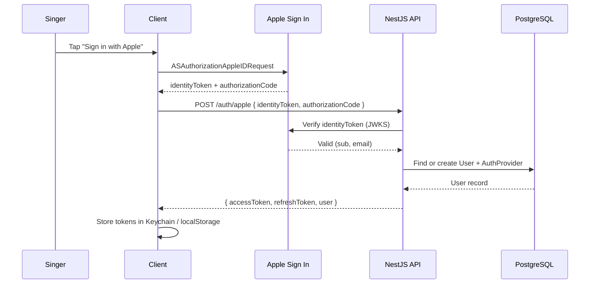
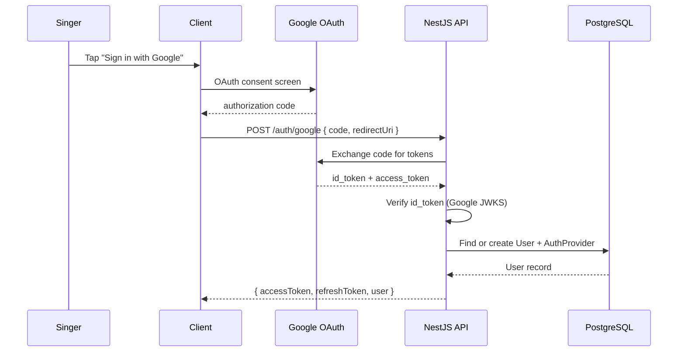
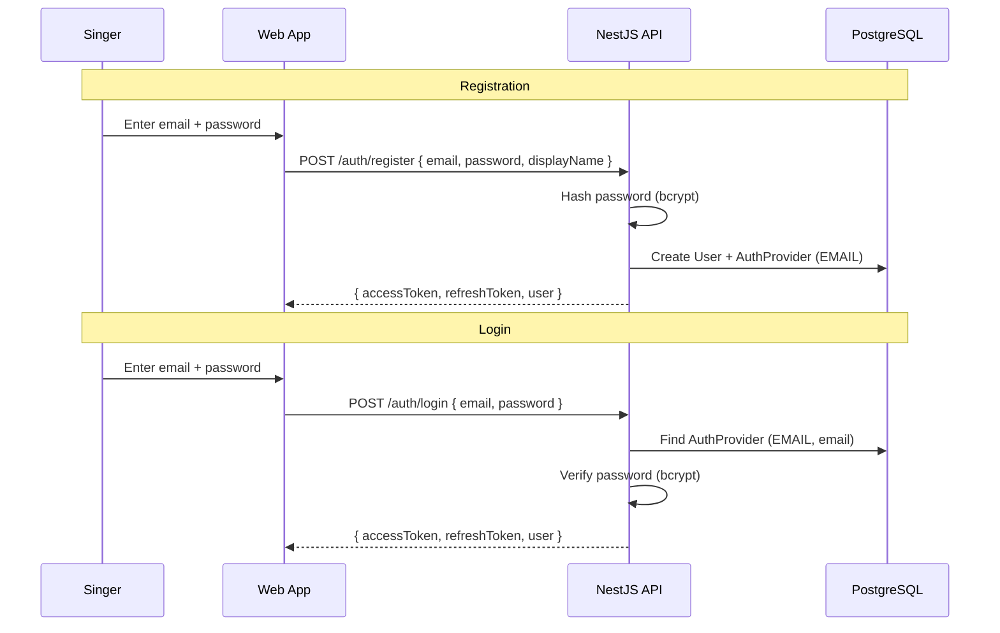
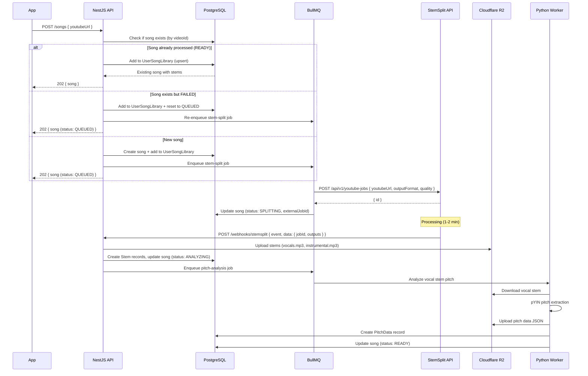
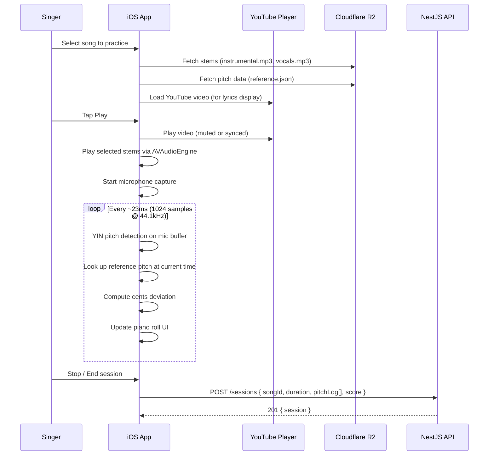

# Intonavio — API Design

## Base URL

```
https://api.intonavio.com/v1
```

All endpoints require `Authorization: Bearer <jwt>` unless noted otherwise.

---

## Authentication Flows

### Apple Sign In (iOS / macOS / Web)



### Google OAuth (Web / iOS)



### Email / Password (Web)



## Song Processing Flow



## Practice Session Flow



---

## Endpoint Reference

### Auth

| Method   | Path             | Description                           | Auth          |
| -------- | ---------------- | ------------------------------------- | ------------- |
| `POST`   | `/auth/apple`    | Exchange Apple identity token for JWT | No            |
| `POST`   | `/auth/google`   | Exchange Google OAuth code for JWT    | No            |
| `POST`   | `/auth/register` | Register with email and password      | No            |
| `POST`   | `/auth/login`    | Login with email and password         | No            |
| `POST`   | `/auth/refresh`  | Refresh access token                  | Refresh token |
| `DELETE` | `/auth/account`  | Delete account and all data           | Yes           |

#### `POST /auth/apple`

**Request:**

```json
{
  "identityToken": "eyJ...",
  "authorizationCode": "c2a...",
  "fullName": { "givenName": "Jane", "familyName": "Doe" }
}
```

**Response (200):**

```json
{
  "accessToken": "eyJ...",
  "refreshToken": "rt_...",
  "user": {
    "id": "cm7user1abcdefghijklmnop",
    "email": "jane@icloud.com",
    "displayName": "Jane D."
  }
}
```

#### `POST /auth/google`

**Request:**

```json
{
  "code": "4/0AX4XfWh...",
  "redirectUri": "https://app.intonavio.com/auth/google/callback"
}
```

**Response (200):** Same shape as Apple auth response.

#### `POST /auth/register`

**Request:**

```json
{
  "email": "jane@example.com",
  "password": "securePassword123",
  "displayName": "Jane D."
}
```

**Response (201):** Same shape as Apple auth response.

#### `POST /auth/login`

**Request:**

```json
{
  "email": "jane@example.com",
  "password": "securePassword123"
}
```

**Response (200):** Same shape as Apple auth response.

---

### Songs

| Method   | Path         | Description                                                              |
| -------- | ------------ | ------------------------------------------------------------------------ |
| `POST`   | `/songs`     | Submit YouTube URL — deduplicates by videoId, adds to user's library     |
| `GET`    | `/songs/:id` | Get song details (must be in user's library)                             |
| `GET`    | `/songs`     | List user's library songs via UserSongLibrary (paginated)                |
| `DELETE` | `/songs/:id` | Remove song from user's library (does not delete the shared song record) |

#### `POST /songs`

Deduplicates by YouTube `videoId`. If the song already exists and is `READY`, it is added to the user's library immediately. If it exists but is `FAILED`, it is re-queued for processing. New songs are created with `QUEUED` status and enqueued for stem splitting.

Always returns `202` regardless of whether the song is new or existing.

**Request:**

```json
{
  "youtubeUrl": "https://www.youtube.com/watch?v=dQw4w9WgXcQ"
}
```

**Response (202) — new or re-queued song:**

```json
{
  "id": "cm7abc123def456ghijklmnop",
  "videoId": "dQw4w9WgXcQ",
  "title": "Rick Astley - Never Gonna Give You Up",
  "artist": "Rick Astley",
  "thumbnailUrl": "https://img.youtube.com/vi/dQw4w9WgXcQ/hqdefault.jpg",
  "duration": 0,
  "status": "QUEUED",
  "stems": [],
  "pitchData": null,
  "createdAt": "2025-06-01T12:00:00Z"
}
```

**Response (202) — existing READY song added to library:**

```json
{
  "id": "cm7abc123def456ghijklmnop",
  "videoId": "dQw4w9WgXcQ",
  "title": "Rick Astley - Never Gonna Give You Up",
  "artist": "Rick Astley",
  "thumbnailUrl": "https://img.youtube.com/vi/dQw4w9WgXcQ/hqdefault.jpg",
  "duration": 213,
  "status": "READY",
  "stems": [
    { "id": "...", "type": "VOCALS", "storageKey": "stems/.../vocals.mp3", "format": "mp3" }
  ],
  "pitchData": { "id": "...", "storageKey": "pitch/.../reference.json" },
  "createdAt": "2025-06-01T12:00:00Z"
}
```

**Song metadata:** The `title` and `artist` fields are fetched from the YouTube oEmbed API (`https://www.youtube.com/oembed?url=...&format=json`) at song creation time. If the oEmbed request fails, `title` falls back to the `videoId` and `artist` is `null`. The `thumbnailUrl` uses a fallback chain: `maxresdefault.jpg` → `hqdefault.jpg` → `mqdefault.jpg`, checked via HEAD requests to find the first available resolution.

#### `GET /songs/:id`

Returns song details only if it exists in the authenticated user's library (via `UserSongLibrary`). Returns `404` if the song is not in the user's library.

**Response (200) — when READY:**

```json
{
  "id": "cm7abc123def456ghijklmnop",
  "videoId": "dQw4w9WgXcQ",
  "title": "Rick Astley - Never Gonna Give You Up",
  "artist": "Rick Astley",
  "thumbnailUrl": "https://img.youtube.com/vi/dQw4w9WgXcQ/hqdefault.jpg",
  "duration": 213,
  "status": "READY",
  "stems": [
    {
      "id": "cm7stem1abcdefghijklmnop",
      "type": "VOCALS",
      "storageKey": "stems/cm7abc123def456ghijklmnop/vocals.mp3",
      "format": "mp3"
    },
    {
      "id": "cm7stem2abcdefghijklmnop",
      "type": "DRUMS",
      "storageKey": "stems/cm7abc123def456ghijklmnop/drums.mp3",
      "format": "mp3"
    },
    {
      "id": "cm7stem3abcdefghijklmnop",
      "type": "BASS",
      "storageKey": "stems/cm7abc123def456ghijklmnop/bass.mp3",
      "format": "mp3"
    },
    {
      "id": "cm7stem4abcdefghijklmnop",
      "type": "OTHER",
      "storageKey": "stems/cm7abc123def456ghijklmnop/other.mp3",
      "format": "mp3"
    },
    {
      "id": "cm7stem5abcdefghijklmnop",
      "type": "PIANO",
      "storageKey": "stems/cm7abc123def456ghijklmnop/piano.mp3",
      "format": "mp3"
    },
    {
      "id": "cm7stem6abcdefghijklmnop",
      "type": "GUITAR",
      "storageKey": "stems/cm7abc123def456ghijklmnop/guitar.mp3",
      "format": "mp3"
    }
  ],
  "pitchData": {
    "id": "cm7pitch1abcdefghijklmno",
    "storageKey": "pitch/cm7abc123def456ghijklmnop/reference.json"
  },
  "createdAt": "2025-06-01T12:00:00Z"
}
```

---

### Stems

| Method | Path                               | Description                |
| ------ | ---------------------------------- | -------------------------- |
| `GET`  | `/songs/:songId/stems`             | List stems for a song      |
| `GET`  | `/songs/:songId/stems/:stemId/url` | Get presigned download URL |

---

### Sessions

| Method | Path            | Description                        |
| ------ | --------------- | ---------------------------------- |
| `POST` | `/sessions`     | Save a practice session            |
| `GET`  | `/sessions`     | List past sessions (paginated)     |
| `GET`  | `/sessions/:id` | Get session details with pitch log |

#### `POST /sessions`

**Request:**

```json
{
  "songId": "cm7abc123def456ghijklmnop",
  "duration": 45,
  "loopStart": 30.5,
  "loopEnd": 55.2,
  "speed": 0.75,
  "overallScore": 72.5,
  "pitchLog": [
    { "time": 30.5, "detectedHz": 440.0, "referenceHz": 440.0, "cents": 0 },
    { "time": 30.55, "detectedHz": 442.1, "referenceHz": 440.0, "cents": 8.3 }
  ]
}
```

**Validation:** `duration` >= 1, `speed` 0.25–2.0 (default 1.0), `overallScore` 0–100. Song must exist and be in `READY` status.

**Response (201):**

```json
{
  "id": "cm7sess1abcdefghijklmnop",
  "songId": "cm7abc123def456ghijklmnop",
  "duration": 45,
  "loopStart": 30.5,
  "loopEnd": 55.2,
  "speed": 0.75,
  "overallScore": 72.5,
  "createdAt": "2025-06-01T12:30:00Z"
}
```

#### `GET /sessions`

**Query params:** `page` (default 1), `limit` (default 20, max 100)

**Response (200):**

```json
{
  "data": [
    {
      "id": "cm7sess1abcdefghijklmnop",
      "songId": "cm7abc123def456ghijklmnop",
      "duration": 45,
      "loopStart": 30.5,
      "loopEnd": 55.2,
      "speed": 0.75,
      "overallScore": 72.5,
      "createdAt": "2025-06-01T12:30:00Z"
    }
  ],
  "meta": { "page": 1, "limit": 20, "total": 1, "totalPages": 1 }
}
```

Note: List response excludes `pitchLog` for payload efficiency.

#### `GET /sessions/:id`

**Response (200):**

Same shape as list item, plus `pitchLog` array. Returns `403` if session belongs to another user.

```json
{
  "id": "cm7sess1abcdefghijklmnop",
  "songId": "cm7abc123def456ghijklmnop",
  "duration": 45,
  "loopStart": 30.5,
  "loopEnd": 55.2,
  "speed": 0.75,
  "overallScore": 72.5,
  "pitchLog": [
    { "time": 30.5, "detectedHz": 440.0, "referenceHz": 440.0, "cents": 0 },
    { "time": 30.55, "detectedHz": 442.1, "referenceHz": 440.0, "cents": 8.3 }
  ],
  "createdAt": "2025-06-01T12:30:00Z"
}
```

---

### Health

| Method | Path               | Description                                   | Auth |
| ------ | ------------------ | --------------------------------------------- | ---- |
| `GET`  | `/health`          | Basic health check (database + Redis)         | No   |
| `GET`  | `/health/detailed` | Detailed health check with BullMQ queue stats | No   |

#### `GET /health`

**Response (200):**

```json
{
  "status": "ok",
  "info": {
    "database": { "status": "up" },
    "redis": { "status": "up" }
  }
}
```

**Response (503) — when unhealthy:**

```json
{
  "status": "error",
  "info": {
    "database": { "status": "up" }
  },
  "error": {
    "redis": { "status": "down" }
  }
}
```

#### `GET /health/detailed`

**Response (200):** Same shape as `/health`, plus `queues` array:

```json
{
  "status": "ok",
  "info": {
    "database": { "status": "up" },
    "redis": { "status": "up" }
  },
  "queues": [
    { "name": "stem-split", "waiting": 3, "active": 1, "failed": 0, "delayed": 0 },
    { "name": "pitch-analysis", "waiting": 0, "active": 0, "failed": 0, "delayed": 0 }
  ]
}
```

---

### Webhooks (Internal)

| Method | Path                  | Description                       | Auth                                           |
| ------ | --------------------- | --------------------------------- | ---------------------------------------------- |
| `POST` | `/webhooks/stemsplit` | StemSplit job completion callback | `X-Webhook-Signature` HMAC-SHA256 verification |

**Webhook Payload (from StemSplit):**

```json
{
  "event": "job.completed",
  "timestamp": "2026-01-05T12:30:00Z",
  "data": {
    "jobId": "clxxx123...",
    "status": "COMPLETED",
    "input": { "durationSeconds": 240 },
    "outputs": {
      "vocals": {
        "url": "https://stemsplit-storage...r2.cloudflarestorage.com/...",
        "expiresAt": "2026-01-05T13:30:00Z"
      },
      "instrumental": {
        "url": "https://stemsplit-storage...r2.cloudflarestorage.com/...",
        "expiresAt": "2026-01-05T13:30:00Z"
      }
    },
    "creditsCharged": 240
  }
}
```

**Webhook Response:** `200 { "received": true }`

**Behavior:**

- Completed: download stems from presigned URLs → upload to R2 → create Stem records → status ANALYZING → enqueue pitch analysis
- Failed: mark song as FAILED with error message
- Idempotent: skips if stems already exist for the song
- Signature verification: HMAC-SHA256 of raw request body using `STEMSPLIT_WEBHOOK_SECRET`

---

## Error Responses

All errors follow a consistent format with a `traceId` for debugging:

```json
{
  "statusCode": 404,
  "error": "Not Found",
  "message": "Song not found in your library",
  "traceId": "trc_a1b2c3d4e5f6a1b2c3d4e5f6"
}
```

| Status | Usage                                                |
| ------ | ---------------------------------------------------- |
| `400`  | Invalid request body or parameters                   |
| `401`  | Missing or invalid JWT                               |
| `403`  | Accessing another user's resource                    |
| `404`  | Resource not found                                   |
| `409`  | Song already being processed (duplicate YouTube URL) |
| `429`  | Rate limit exceeded                                  |
| `500`  | Internal server error                                |
