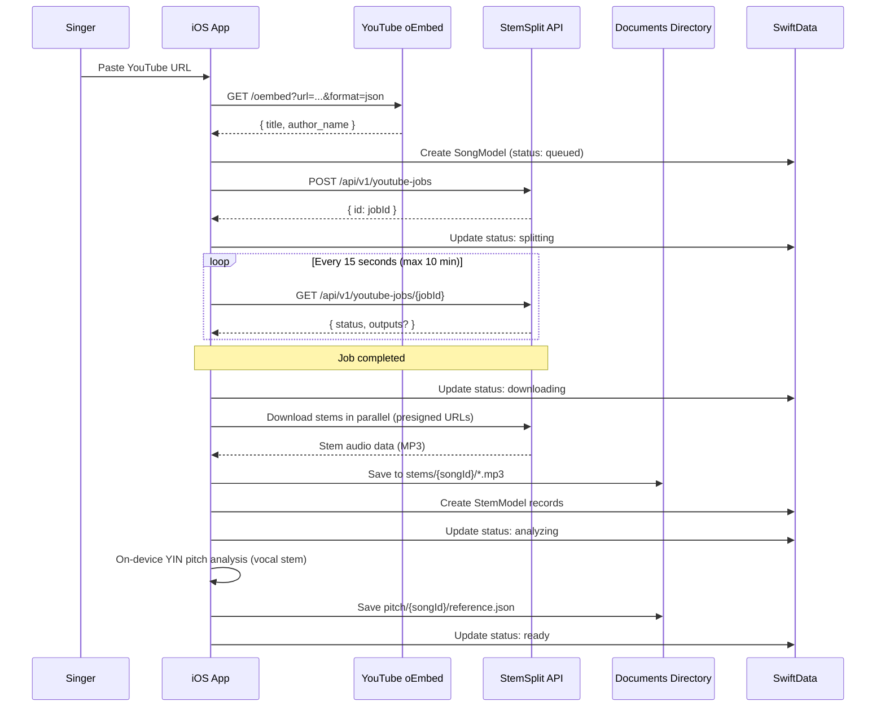
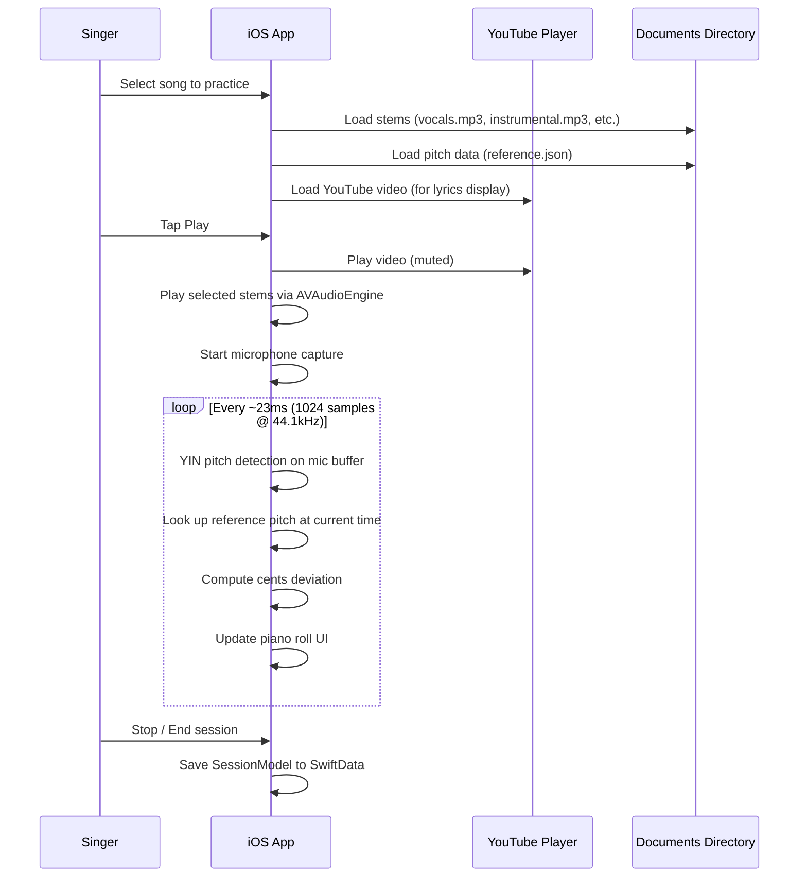

# IntonavioLocal — External API Contracts

IntonavioLocal calls two external APIs directly from the iOS app. There is no backend server — all API calls use URLSession.

---

## StemSplit API

Stem separation service. The user provides their own API key, stored in Keychain.

**Base URL:** `https://api.stemsplit.com`

### Job Creation

Creates a stem separation job from a YouTube URL.

```
POST /api/v1/youtube-jobs
Authorization: Bearer <user's StemSplit API key>
Content-Type: application/json
```

**Request:**

```json
{
  "youtubeUrl": "https://www.youtube.com/watch?v=dQw4w9WgXcQ",
  "outputType": "SIX_STEMS",
  "outputFormat": "MP3",
  "quality": "BEST"
}
```

**Response (2xx):**

```json
{
  "id": "clxxx123..."
}
```

The app uses `SIX_STEMS` output type to get vocals, drums, bass, piano, guitar, and other stems. YouTube jobs may also include an instrumental stem in the outputs.

### Job Status Polling

Poll for job completion. The app polls every 15 seconds, with a 10-minute timeout (40 attempts).

```
GET /api/v1/youtube-jobs/{jobId}
Authorization: Bearer <user's StemSplit API key>
```

**Response (completed):**

```json
{
  "status": "COMPLETED",
  "videoDuration": 213,
  "durationSeconds": 213,
  "outputs": {
    "vocals": {
      "url": "https://stemsplit-storage....r2.cloudflarestorage.com/...",
      "expiresAt": "2026-01-05T13:30:00Z"
    },
    "instrumental": {
      "url": "https://stemsplit-storage....r2.cloudflarestorage.com/...",
      "expiresAt": "2026-01-05T13:30:00Z"
    },
    "drums": {
      "url": "...",
      "expiresAt": "..."
    },
    "bass": {
      "url": "...",
      "expiresAt": "..."
    },
    "piano": {
      "url": "...",
      "expiresAt": "..."
    },
    "guitar": {
      "url": "...",
      "expiresAt": "..."
    },
    "other": {
      "url": "...",
      "expiresAt": "..."
    }
  }
}
```

**Response (failed):**

```json
{
  "status": "FAILED",
  "error": "Description of what went wrong"
}
```

**Response (processing):**

```json
{
  "status": "IN_PROGRESS"
}
```

### Stem Download

Each stem output contains a presigned URL that the app downloads directly. These URLs expire (typically 1 hour). The app downloads all stems in parallel using a `TaskGroup`.

```
GET <presigned URL from outputs>
```

Returns raw audio data (MP3).

### Error Handling

| Error                     | App Behavior                                  |
| ------------------------- | --------------------------------------------- |
| No API key configured     | Show "Add API key in Settings" message        |
| Job creation fails (4xx)  | Mark song FAILED, show error body             |
| Job creation fails (5xx)  | Mark song FAILED, user can retry              |
| Polling timeout (10 min)  | Mark song FAILED with timeout message         |
| Job status returns FAILED | Mark song FAILED with StemSplit error message |
| Stem download fails       | Mark song FAILED, user can retry              |

### StemSplit Pricing Note

StemSplit charges credits based on audio duration in seconds. A user needs their own API key and credits. The app does not manage billing.

---

## YouTube oEmbed API

Used to fetch song metadata (title, artist name) when a user submits a YouTube URL.

**Endpoint:** `https://www.youtube.com/oembed`

### Metadata Fetch

```
GET /oembed?url=https://www.youtube.com/watch?v={videoId}&format=json
```

**Response:**

```json
{
  "title": "Rick Astley - Never Gonna Give You Up (Official Music Video)",
  "author_name": "Rick Astley",
  "author_url": "https://www.youtube.com/@RickAstleyYT",
  "type": "video",
  "height": 113,
  "width": 200,
  "version": "1.0",
  "provider_name": "YouTube",
  "provider_url": "https://www.youtube.com/",
  "thumbnail_url": "https://i.ytimg.com/vi/dQw4w9WgXcQ/hqdefault.jpg",
  "thumbnail_height": 360,
  "thumbnail_width": 480,
  "html": "<iframe ...>"
}
```

The app uses `title` and `author_name` from the response.

### Thumbnail Resolution

The app resolves the best available thumbnail using HEAD requests with a fallback chain:

1. `https://img.youtube.com/vi/{videoId}/maxresdefault.jpg`
2. `https://img.youtube.com/vi/{videoId}/hqdefault.jpg`
3. `https://img.youtube.com/vi/{videoId}/mqdefault.jpg`

The first URL that returns HTTP 200 is used. Falls back to `mqdefault.jpg` if all fail.

### Error Handling

If the oEmbed request fails, the app still creates the song with the `videoId` as the title and `nil` artist. The thumbnail falls back through the resolution chain.

---

## Song Processing Flow

The full pipeline from URL submission to practice-ready song, orchestrated by `SongProcessingService`:



---

## Practice Session Flow


