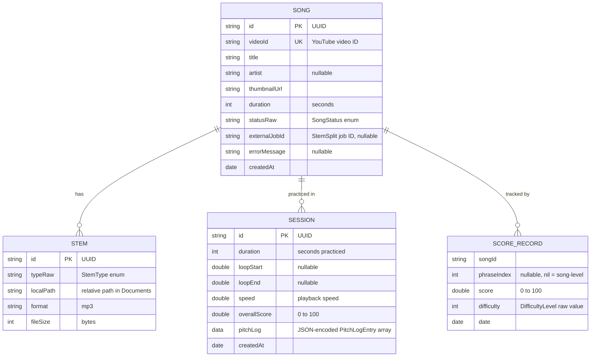

# IntonavioLocal — Data Models

## Entity Relationship Diagram



---

## SwiftData Models

### SongModel

Represents a song in the user's library. Tracks processing status and links to stems and sessions.

```swift
@Model
final class SongModel {
    @Attribute(.unique) var id: String          // UUID string
    @Attribute(.unique) var videoId: String      // YouTube video ID
    var title: String                            // From YouTube oEmbed
    var artist: String?                          // author_name from oEmbed
    var thumbnailUrl: String                     // Best available thumbnail
    var duration: Int                            // Seconds (from StemSplit)
    var statusRaw: String                        // SongStatus raw value
    var externalJobId: String?                   // StemSplit job ID
    var errorMessage: String?                    // Error description if FAILED
    var createdAt: Date

    @Relationship(deleteRule: .cascade, inverse: \StemModel.song)
    var stems: [StemModel] = []

    @Relationship(deleteRule: .cascade, inverse: \SessionModel.song)
    var sessions: [SessionModel] = []

    // Computed: SongStatus enum accessor
    var status: SongStatus { get set }

    // Computed: checks Documents/pitch/{id}/reference.json exists
    var hasPitchData: Bool { get }
}
```

**Notes:**
- `statusRaw` stores the enum as a string because SwiftData `@Model` does not natively support custom enums. The computed `status` property provides type-safe access.
- `hasPitchData` checks the file system directly because pitch data is stored as a JSON file, not in SwiftData.
- Cascade delete on stems and sessions ensures cleanup when a song is removed.

### StemModel

Represents a single audio stem file stored on disk.

```swift
@Model
final class StemModel {
    @Attribute(.unique) var id: String      // UUID string
    var typeRaw: String                      // StemType raw value
    var localPath: String                    // Relative path: "stems/{songId}/{type}.mp3"
    var format: String                       // "mp3"
    var fileSize: Int                        // Bytes

    var song: SongModel?                     // Inverse relationship

    // Computed: StemType enum accessor
    var type: StemType { get set }
}
```

**Notes:**
- `localPath` is relative to the Documents directory. The full URL is resolved by `LocalStorageService`.
- File naming convention: `stems/{songId}/{stemtype}.mp3` (lowercase stem type).

### SessionModel

Represents a completed practice session.

```swift
@Model
final class SessionModel {
    @Attribute(.unique) var id: String      // UUID string
    var duration: Int                         // Seconds practiced
    var loopStart: Double?                   // Loop start time in seconds
    var loopEnd: Double?                     // Loop end time in seconds
    var speed: Double                        // Playback speed (0.25-2.0)
    var overallScore: Double                 // 0-100
    var pitchLog: Data?                      // JSON-encoded [PitchLogEntry]
    var createdAt: Date

    var song: SongModel?                     // Inverse relationship

    // Computed: decodes pitchLog Data to [PitchLogEntry]
    var decodedPitchLog: [PitchLogEntry] { get }
}
```

**Notes:**
- `pitchLog` is stored as `Data` (JSON-encoded) because SwiftData does not support arrays of custom structs as stored properties. The `decodedPitchLog` computed property handles deserialization.
- Sessions are cascade-deleted when their parent song is removed.

### ScoreRecord

Tracks per-song and per-phrase best scores across difficulty levels.

```swift
@Model
final class ScoreRecord {
    var songId: String                       // References SongModel.id
    var phraseIndex: Int?                    // nil = song-level score
    var score: Double                        // 0-100
    var date: Date
    var difficulty: Int                      // DifficultyLevel raw value (0/1/2)
}
```

**Notes:**
- Not linked via SwiftData `@Relationship` to SongModel — uses `songId` string reference to avoid circular dependency issues.
- `ScoreRepository` manages all CRUD operations and personal best lookups.
- `phraseIndex` of `nil` represents the overall song score; an integer value represents a specific phrase.

---

## Enum Definitions

### SongStatus

| Value         | Description                                  |
| ------------- | -------------------------------------------- |
| `QUEUED`      | Song submitted, waiting for processing       |
| `DOWNLOADING` | Stems being downloaded from StemSplit URLs   |
| `SPLITTING`   | StemSplit API is separating stems            |
| `ANALYZING`   | On-device YIN pitch extraction in progress   |
| `READY`       | Stems and pitch data available for practice  |
| `FAILED`      | Processing failed (see `errorMessage`)       |

```swift
enum SongStatus: String, Codable, Sendable {
    case queued = "QUEUED"
    case downloading = "DOWNLOADING"
    case splitting = "SPLITTING"
    case analyzing = "ANALYZING"
    case ready = "READY"
    case failed = "FAILED"

    var isProcessing: Bool { ... }
}
```

### StemType

| Value            | Description                                              |
| ---------------- | -------------------------------------------------------- |
| `VOCALS`         | Isolated vocal track                                     |
| `INSTRUMENTAL`   | Isolated instrumental mix                                |
| `DRUMS`          | Isolated percussion                                      |
| `BASS`           | Isolated bass line                                       |
| `OTHER`          | Remaining instruments (synths, strings)                  |
| `PIANO`          | Isolated piano/keys track                                |
| `GUITAR`         | Isolated guitar track                                    |
| `FULL`           | Full audio mix from StemSplit                            |

```swift
enum StemType: String, Codable, Sendable {
    case vocals = "VOCALS"
    case instrumental = "INSTRUMENTAL"
    case drums = "DRUMS"
    case bass = "BASS"
    case other = "OTHER"
    case piano = "PIANO"
    case guitar = "GUITAR"
    case full = "FULL"
}
```

### PitchLogEntry

Timestamped pitch detection result stored in session pitch logs.

```swift
struct PitchLogEntry: Codable, Sendable {
    let time: Double          // Seconds from session start
    let detectedHz: Double?   // Detected frequency (nil if unvoiced)
    let referenceHz: Double?  // Reference frequency at this time
    let cents: Double?        // Cents deviation from reference
}
```

---

## File Storage Layout

Audio files and pitch data are stored in the app's Documents directory:

```
Documents/
├── stems/
│   ├── {songId}/
│   │   ├── vocals.mp3
│   │   ├── instrumental.mp3
│   │   ├── drums.mp3
│   │   ├── bass.mp3
│   │   ├── piano.mp3
│   │   ├── guitar.mp3
│   │   └── other.mp3
│   └── {songId}/
│       └── ...
└── pitch/
    ├── {songId}/
    │   └── reference.json
    └── {songId}/
        └── reference.json
```

`LocalStorageService` provides path resolution and directory management for all file operations.

---

## Pitch Data JSON Format

The pitch data file contains frame-by-frame pitch information extracted on-device by the YIN algorithm.

**File location:** `Documents/pitch/{songId}/reference.json`

```json
{
  "songId": null,
  "sampleRate": 44100,
  "hopSize": 512,
  "frameCount": 18432,
  "hopDuration": 0.0116,
  "frames": [
    { "t": 0.0, "hz": null, "midi": null, "voiced": false, "rms": 0.0001 },
    { "t": 0.0116, "hz": null, "midi": null, "voiced": false, "rms": 0.0002 },
    { "t": 0.5104, "hz": 329.63, "midi": 64.0, "voiced": true, "rms": 0.15 },
    { "t": 0.522, "hz": 330.12, "midi": 64.1, "voiced": true, "rms": 0.14 }
  ],
  "phrases": [
    { "index": 0, "startFrame": 44, "endFrame": 172, "startTime": 0.5104, "endTime": 1.9952, "voicedFrameCount": 118 }
  ]
}
```

| Field    | Type     | Description                                                        |
| -------- | -------- | ------------------------------------------------------------------ |
| `t`      | `float`  | Time in seconds from start of track (4 decimal places)             |
| `hz`     | `float?` | Detected frequency in Hz (`null` if unvoiced)                      |
| `midi`   | `float?` | MIDI note number, 1 decimal place (`null` if unvoiced)             |
| `voiced` | `bool`   | Whether a pitched vocal was detected at this frame                 |
| `rms`    | `float?` | Per-frame RMS energy via vDSP_rmsqv (artifact filtering)          |

**Phrase data** is also included, with detected vocal phrases (contiguous voiced regions with gaps < 0.3s merged).

**Design notes:**

- Hop size of 512 samples at 44.1kHz gives ~11.6ms resolution
- Unvoiced frames are explicitly marked so the client can skip them during scoring
- MIDI note numbers simplify note-level bucketing (e.g., "you sang E4 instead of F4")
- `rms` enables filtering of low-energy artifacts from imperfect stem separation. Frames with `rms < 0.02` are treated as inaudible
