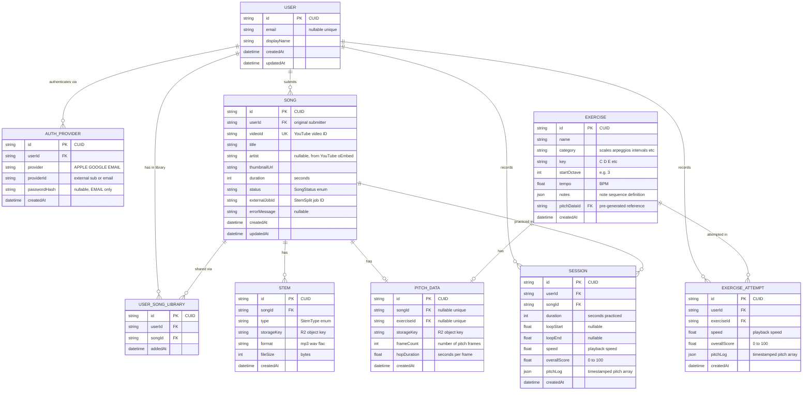

# Intonavio — Data Models

## Entity Relationship Diagram



---

## Prisma Schema

```prisma
generator client {
  provider = "prisma-client-js"
}

datasource db {
  provider = "postgresql"
  url      = env("DATABASE_URL")
}

// ─── Enums ───────────────────────────────────────────

enum AuthProviderType {
  APPLE
  GOOGLE
  EMAIL
}

enum SongStatus {
  QUEUED
  DOWNLOADING
  SPLITTING
  ANALYZING
  READY
  FAILED
}

enum ExerciseCategory {
  SCALES
  ARPEGGIOS
  INTERVALS
  SUSTAINED
  VIBRATO
  CUSTOM
}

enum StemType {
  VOCALS
  DRUMS
  BASS
  OTHER
  PIANO
  GUITAR
  FULL
}

// ─── Models ──────────────────────────────────────────

model User {
  id          String   @id @default(cuid())
  email       String?  @unique
  displayName String
  createdAt   DateTime @default(now())
  updatedAt   DateTime @updatedAt

  authProviders    AuthProvider[]
  songs            Song[]
  sessions         Session[]
  exerciseAttempts ExerciseAttempt[]
  userSongLibrary  UserSongLibrary[]
}

model AuthProvider {
  id           String           @id @default(cuid())
  userId       String
  provider     AuthProviderType
  providerId   String           // Apple sub, Google sub, or email address
  passwordHash String?          // Only for EMAIL provider (bcrypt)
  createdAt    DateTime         @default(now())

  user User @relation(fields: [userId], references: [id], onDelete: Cascade)

  @@unique([provider, providerId])
  @@index([userId])
}

model Song {
  id            String     @id @default(cuid())
  userId        String     // Original submitter (who triggered processing)
  videoId       String     @unique
  title         String     // Fetched from YouTube oEmbed API at creation
  artist        String?    // Author name from YouTube oEmbed API
  thumbnailUrl  String     // Best available thumbnail (maxresdefault → hqdefault → mqdefault fallback)
  duration      Int        // seconds
  status        SongStatus @default(QUEUED)
  externalJobId String?    // StemSplit job ID
  errorMessage  String?
  createdAt     DateTime   @default(now())
  updatedAt     DateTime   @updatedAt

  user            User              @relation(fields: [userId], references: [id], onDelete: Cascade)
  stems           Stem[]
  pitchData       PitchData?
  sessions        Session[]
  userSongLibrary UserSongLibrary[]

  @@index([userId])
  @@index([status])
}

// Join table: tracks which users have a song in their library.
// Enables "process once, serve many" — multiple users share the same processed song.
model UserSongLibrary {
  id     String   @id @default(cuid())
  userId String
  songId String
  addedAt DateTime @default(now())

  user User @relation(fields: [userId], references: [id], onDelete: Cascade)
  song Song @relation(fields: [songId], references: [id], onDelete: Cascade)

  @@unique([userId, songId])
  @@index([userId])
  @@index([songId])
}

model Stem {
  id         String   @id @default(cuid())
  songId     String
  type       StemType
  storageKey String   // R2 object key: "stems/{songId}/{TYPE}.mp3"
  format     String   @default("mp3")
  fileSize   Int      // bytes
  createdAt  DateTime @default(now())

  song Song @relation(fields: [songId], references: [id], onDelete: Cascade)

  @@unique([songId, type])
}

model PitchData {
  id          String   @id @default(cuid())
  songId      String?  @unique
  exerciseId  String?  @unique
  storageKey  String   // R2 object key: "pitch/{songId|exerciseId}/reference.json"
  frameCount  Int
  hopDuration Float    // seconds per frame (e.g., 0.01 for 10ms hops)
  createdAt   DateTime @default(now())

  song     Song?     @relation(fields: [songId], references: [id], onDelete: Cascade)
  exercise Exercise? @relation(fields: [exerciseId], references: [id], onDelete: Cascade)
}

model Session {
  id           String   @id @default(cuid())
  userId       String
  songId       String
  duration     Int      // seconds
  loopStart    Float?   // seconds
  loopEnd      Float?   // seconds
  speed        Float    @default(1.0)
  overallScore Float    // 0-100
  pitchLog     Json     // [{time, detectedHz, referenceHz, cents}]
  createdAt    DateTime @default(now())

  user User @relation(fields: [userId], references: [id], onDelete: Cascade)
  song Song @relation(fields: [songId], references: [id], onDelete: Cascade)

  @@index([userId])
  @@index([songId])
  @@index([createdAt])
}

model Exercise {
  id          String           @id @default(cuid())
  name        String           // "Major Scale Ascending"
  category    ExerciseCategory
  key         String           // "C", "D", "Eb", etc.
  startOctave Int              @default(4)
  tempo       Float            @default(60.0) // BPM
  notes       Json             // [{midi, duration, rest, vibrato?}]
  createdAt   DateTime         @default(now())

  pitchData PitchData?
  attempts  ExerciseAttempt[]

  @@unique([name, key, startOctave])
}

model ExerciseAttempt {
  id           String   @id @default(cuid())
  userId       String
  exerciseId   String
  speed        Float    @default(1.0)
  overallScore Float    // 0-100
  pitchLog     Json     // [{time, detectedHz, referenceHz, cents}]
  createdAt    DateTime @default(now())

  user     User     @relation(fields: [userId], references: [id], onDelete: Cascade)
  exercise Exercise @relation(fields: [exerciseId], references: [id], onDelete: Cascade)

  @@index([userId])
  @@index([exerciseId])
  @@index([createdAt])
}
```

---

## Enum Definitions

### AuthProviderType

| Value    | Description                      |
| -------- | -------------------------------- |
| `APPLE`  | Apple Sign In (iOS, macOS, Web)  |
| `GOOGLE` | Google OAuth 2.0                 |
| `EMAIL`  | Email + password (bcrypt hashed) |

A user can have multiple auth providers linked (e.g., sign up with email, later link Google). The `@@unique([provider, providerId])` constraint prevents duplicate provider entries.

### SongStatus

| Value         | Description                              |
| ------------- | ---------------------------------------- |
| `QUEUED`      | Song submitted, waiting for processing   |
| `DOWNLOADING` | YouTube audio being fetched by StemSplit |
| `SPLITTING`   | StemSplit is separating stems            |
| `ANALYZING`   | Python worker extracting reference pitch |
| `READY`       | Stems and pitch data available           |
| `FAILED`      | Processing failed (see `errorMessage`)   |

### StemType

| Value    | Description                                            |
| -------- | ------------------------------------------------------ |
| `VOCALS` | Isolated vocal track                                   |
| `DRUMS`  | Isolated percussion                                    |
| `BASS`   | Isolated bass line                                     |
| `OTHER`  | Remaining instruments (synths, strings)                |
| `PIANO`  | Isolated piano/keys track                              |
| `GUITAR` | Isolated guitar track                                  |
| `FULL`   | Full audio mix from StemSplit (replaces YouTube audio) |

### ExerciseCategory

| Value       | Description                                        |
| ----------- | -------------------------------------------------- |
| `SCALES`    | Major, minor, chromatic, pentatonic scales         |
| `ARPEGGIOS` | Broken chords ascending and descending             |
| `INTERVALS` | Two-note jumps (thirds, fifths, octaves)           |
| `SUSTAINED` | Hold a single pitch for duration                   |
| `VIBRATO`   | Sustained notes with intentional pitch oscillation |
| `CUSTOM`    | User-defined or imported exercises                 |

---

## Exercise Note Definition Format

The `notes` JSON field on the Exercise model defines the sequence of pitches the singer should produce. A generator expands this into the same frame-by-frame pitch data JSON used by songs.

```json
{
  "name": "Major Scale Ascending",
  "category": "SCALES",
  "key": "C",
  "startOctave": 4,
  "tempo": 80,
  "notes": [
    { "midi": 60, "duration": 1.0, "rest": 0.25 },
    { "midi": 62, "duration": 1.0, "rest": 0.25 },
    { "midi": 64, "duration": 1.0, "rest": 0.25 },
    { "midi": 65, "duration": 1.0, "rest": 0.25 },
    { "midi": 67, "duration": 1.0, "rest": 0.25 },
    { "midi": 69, "duration": 1.0, "rest": 0.25 },
    { "midi": 71, "duration": 1.0, "rest": 0.25 },
    { "midi": 72, "duration": 1.0, "rest": 0.0 }
  ]
}
```

**With vibrato embellishment:**

```json
{ "midi": 67, "duration": 2.0, "rest": 0.5, "vibrato": { "cents": 30, "rateHz": 5.5 } }
```

| Field            | Type      | Description                                       |
| ---------------- | --------- | ------------------------------------------------- |
| `midi`           | `int`     | MIDI note number (60 = C4)                        |
| `duration`       | `float`   | Note duration in beats (scaled by tempo)          |
| `rest`           | `float`   | Rest after note in beats                          |
| `vibrato`        | `object?` | Optional vibrato modulation                       |
| `vibrato.cents`  | `float`   | Vibrato depth (±cents from center pitch)          |
| `vibrato.rateHz` | `float`   | Vibrato oscillation rate in Hz (typically 4–7 Hz) |

The generator converts this definition into the standard `{t, hz, midi, voiced, rms}` frame array at 11.6ms hop intervals. Vibrato is rendered as a sine modulation: `hz = baseHz × 2^(cents × sin(2π × rateHz × t) / 1200)`. Rest periods produce unvoiced frames.

---

## Pitch Data JSON Format

The pitch data file stored in R2 contains frame-by-frame pitch information. For songs, this is extracted by the Python worker using pYIN. For exercises, it is generated deterministically from the exercise note definition.

**File location:** `pitch/{songId}/reference.json`

```json
{
  "songId": "cm7abc123def456ghijklmnop",
  "sampleRate": 44100,
  "hopDuration": 0.0116,
  "frames": [
    { "t": 0.0, "hz": null, "midi": null, "voiced": false, "rms": 0.0001 },
    { "t": 0.0116, "hz": null, "midi": null, "voiced": false, "rms": 0.0002 },
    { "t": 0.5104, "hz": 329.63, "midi": 64.0, "voiced": true, "rms": 0.15 },
    { "t": 0.522, "hz": 330.12, "midi": 64.1, "voiced": true, "rms": 0.14 }
  ]
}
```

| Field    | Type     | Description                                                            |
| -------- | -------- | ---------------------------------------------------------------------- |
| `t`      | `float`  | Time in seconds from start of track (4 decimal places)                 |
| `hz`     | `float?` | Detected frequency in Hz (`null` if unvoiced)                          |
| `midi`   | `float?` | MIDI note number, 1 decimal place (`null` if unvoiced)                 |
| `voiced` | `bool`   | Whether a pitched vocal was detected at this frame                     |
| `rms`    | `float?` | Per-frame RMS energy from `librosa.feature.rms()` (artifact filtering) |

**Design notes:**

- Hop size of 512 samples at 44.1kHz gives ~11.6ms resolution — sufficient for note-level comparison
- Unvoiced frames (breaths, silence, consonants) are explicitly marked so the client can skip them during scoring
- MIDI note numbers simplify note-level bucketing on the client (e.g., "you sang E4 instead of F4")
- `rms` enables filtering of low-energy artifacts from imperfect stem separation. Frames with `rms < 0.02` are treated as inaudible on the client (excluded from rendering and MIDI range computation). The threshold filters residual noise that pYIN marks as "voiced" but is not real vocal signal.
