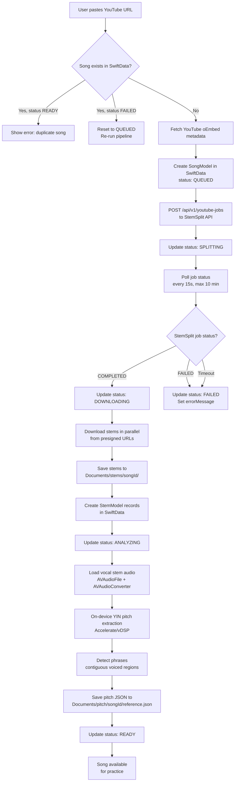
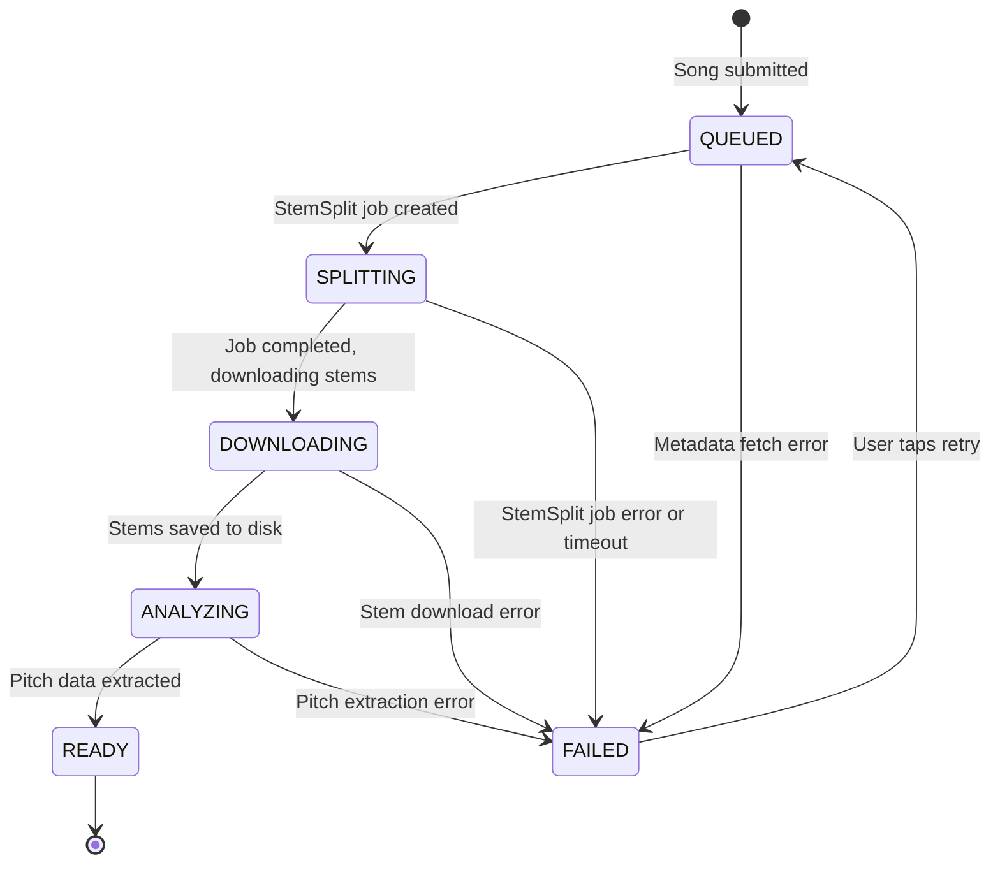

# IntonavioLocal — Audio Processing Pipeline

## Processing Pipeline Overview

End-to-end flow from YouTube URL submission to practice-ready song. All processing is orchestrated by `SongProcessingService` as a single async Swift Task.



## Job State Machine

States a song goes through during processing.



## Song Deduplication

Songs are deduplicated by YouTube `videoId` in SwiftData. If a user submits a URL for a song that already exists:

- **Status READY**: the submission is rejected with "already in your library"
- **Status FAILED**: the song is reset to QUEUED and reprocessed
- **Status processing**: the submission is rejected as duplicate

---

## StemSplit API Integration

The app calls the StemSplit API directly via `StemSplitService` using URLSession. No backend proxy.

### Job Creation

```
POST https://api.stemsplit.com/api/v1/youtube-jobs
Authorization: Bearer <user's API key from Keychain>
```

Body: `{ youtubeUrl, outputType: "SIX_STEMS", outputFormat: "MP3", quality: "BEST" }`

Returns `{ id: "..." }` — stored as `song.externalJobId`.

### Job Polling

```
GET https://api.stemsplit.com/api/v1/youtube-jobs/{jobId}
Authorization: Bearer <user's API key>
```

Polled every 15 seconds. Maximum 40 attempts (10 minutes). Returns status, outputs (presigned URLs), and duration.

### Stem Download

All stems from the `outputs` dictionary are downloaded in parallel using a `TaskGroup`. Each stem is saved to `Documents/stems/{songId}/{stemtype}.mp3`. The stem type is parsed from the output key name (e.g., "vocals" -> `.vocals`, "instrumental" -> `.instrumental`).

---

## iOS Audio Architecture: Unified AudioEngine

All audio I/O (stem playback + microphone input) runs through a single shared `AudioEngine` instance. This is required for Voice Processing (VPIO/AEC) to work on iOS — the system needs to see both the output going to speakers and the input from the microphone on the same `AVAudioEngine` to cancel speaker bleed from the mic.

### Unified Audio Graph

```
Microphone -> inputNode (VP/AEC enabled) -- tap --> PitchDetector ring buffer

PlayerNode(vocals)  --+
PlayerNode(other)   --+-> stemMixer -> timePitch -> mainMixerNode -> output
PlayerNode(full)    --+
```

### AudioEngine Lifecycle

1. **`prepare()`** — Configure audio session (`.playAndRecord`, `.measurement`) and enable voice processing on `inputNode`. Must be called before attaching nodes — VP re-creates the audio graph.
2. **Attach nodes** — `StemPlayer.setup()` attaches player nodes, mixer, and timePitch to the prepared engine.
3. **`start()`** — Start the engine with all nodes connected. Observes interruption and route change notifications. Idempotent — safe to call from multiple consumers.

`StemPlayer`, `PitchDetector`, and `MetronomeTick` all accept a shared `AudioEngine` via init. None creates its own `AVAudioEngine`.

### Why One Engine?

Previous architecture used separate engines for `StemPlayer` (output) and `PitchDetector` (input). On iOS, enabling `setVoiceProcessingEnabled(true)` on one engine's input node caused VPIO render errors because both engines competed for audio I/O hardware. With a single engine, VPIO sees the stem output and cancels it from the mic input.

### Audio Route Change Handling

When the audio output route changes (e.g., AirPods connected/disconnected), iOS posts `AVAudioSession.routeChangeNotification`. `AudioEngine` observes this and:

1. Ensures the engine is still running (route changes can stop it)
2. Fires an `onRouteChange` callback so consumers can re-sync playback

`PracticeViewModel` handles the callback by stopping all stems, re-applying the current audio mode volumes, and restarting playback from the current YouTube time.

### TimePitch Latency Compensation

`AVAudioUnitTimePitch` introduces processing latency (~125ms). `StemPlayer.play(from:)` compensates by scheduling stems ahead by `timePitch.latency`:

```swift
let compensated = time + timePitch.latency
```

### Video-Audio Drift Correction

`VideoAudioSync` polls YouTube time every 2 seconds and compares it with the stem player's current position (adjusted for TimePitch latency). If drift exceeds 150ms, stems are seeked to match YouTube. YouTube is the master clock — stems follow.

### Audio Session Configuration

```swift
AVAudioSession.sharedInstance().setCategory(
    .playAndRecord,
    mode: .measurement,
    options: [.defaultToSpeaker, .allowBluetooth, .mixWithOthers]
)
```

Additional pre-detection filtering:

- **RMS noise gate**: `vDSP_rmsqv` (Accelerate) — skip YIN if RMS < 0.01 (~-40 dB)
- **Confidence threshold**: 0.85
- **MIDI jump filter**: Reject >12 semitone jumps within 50ms

---

## On-Device Pitch Analysis (PitchAnalyzer)

Reference pitch data is extracted entirely on-device using the YIN algorithm with Accelerate/vDSP. No server-side processing.

### Pipeline

1. **Load** vocal stem from `Documents/stems/{songId}/vocals.mp3` using `AVAudioFile` + `AVAudioConverter` at 44.1kHz mono
2. **Extract pitch** using `YINDetector` (5-step YIN with Accelerate vDSP):
   - Window size: 2048 samples
   - Hop size: 512 samples (~11.6ms)
   - Min frequency: 65 Hz (C2), max frequency: 2093 Hz (C7)
   - YIN threshold: from `PitchConstants.yinThreshold`
3. **Compute RMS** energy per frame using `vDSP_rmsqv` (same window)
4. **Convert** frequencies to MIDI note numbers
5. **Detect phrases** — contiguous voiced regions with gaps < 0.3s merged, minimum phrase length 0.5s
6. **Build** JSON with frames array (`t`, `hz`, `midi`, `voiced`, `rms`) and phrases array
7. **Save** JSON to `Documents/pitch/{songId}/reference.json`

### Key Parameters

| Parameter     | Value         | Rationale                                            |
| ------------- | ------------- | ---------------------------------------------------- |
| Sample rate   | 44,100 Hz     | Standard audio quality                               |
| Window size   | 2,048 samples | YIN analysis window                                  |
| Hop length    | 512 samples   | ~11.6ms — matches real-time detection resolution     |
| Min frequency | 65 Hz (C2)    | Covers bass vocal range                              |
| Max frequency | 2,093 Hz (C7) | Covers soprano vocal range                           |
| Algorithm     | YIN           | Fast, suitable for on-device processing              |
| RMS threshold | 0.02          | Filter low-energy artifacts from imperfect stems     |

### RMS Energy (Artifact Filtering)

Per-frame RMS energy is computed alongside pitch extraction using `vDSP_rmsqv`. Frames with `rms < 0.02` are treated as unvoiced regardless of YIN detection result. This filters residual noise from imperfect stem separation that would otherwise produce visible artifacts on the piano roll.

### Phrase Detection

The phrase detector identifies contiguous vocal regions in the reference pitch data:

1. **Raw phrase detection**: Find contiguous sequences of active frames (voiced + RMS above threshold)
2. **Gap merging**: Gaps shorter than 0.3 seconds within a phrase are bridged
3. **Short phrase merging**: Phrases shorter than 0.5 seconds are merged into the nearest neighbor
4. **Reindexing**: Final phrases are numbered sequentially with start/end times and voiced frame counts

Phrases are used for per-phrase scoring during practice.

---

## Cost Optimization

| Strategy               | Description                                                                  |
| ---------------------- | ---------------------------------------------------------------------------- |
| **Song deduplication** | Same videoId checked before creating a new StemSplit job                      |
| **On-device pitch**    | No server costs for pitch analysis — runs locally via Accelerate             |
| **Local storage**      | No cloud storage costs — stems and pitch data stored on device               |
| **Lazy processing**    | Only process songs when requested by the user                                |
| **Parallel downloads** | Stems downloaded concurrently to minimize wall time                          |
| **StemSplit pricing**  | Credits = audio duration in seconds, charged to user's own API key           |
