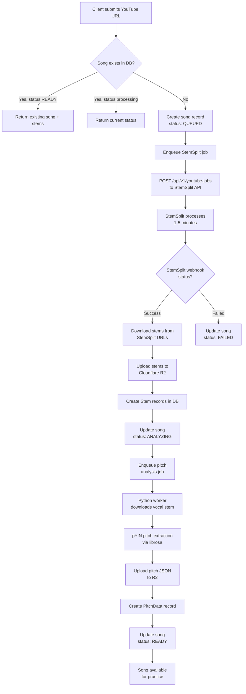
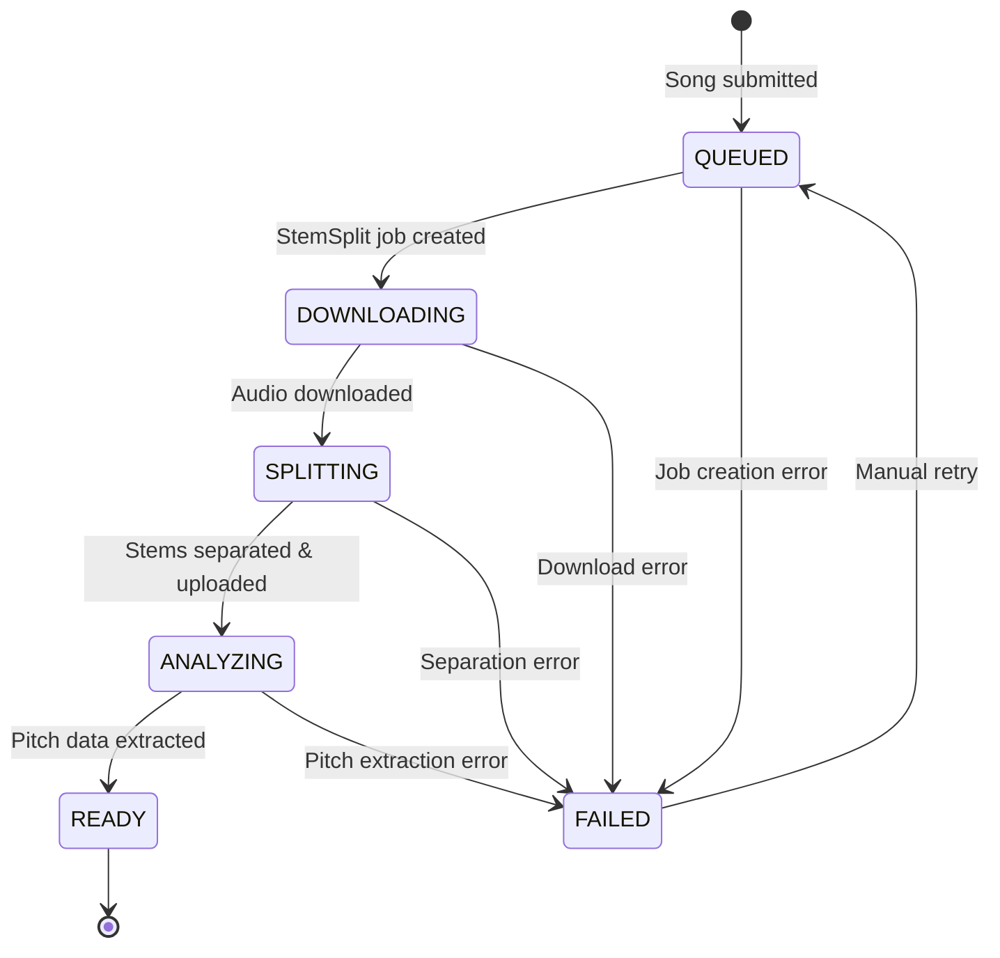
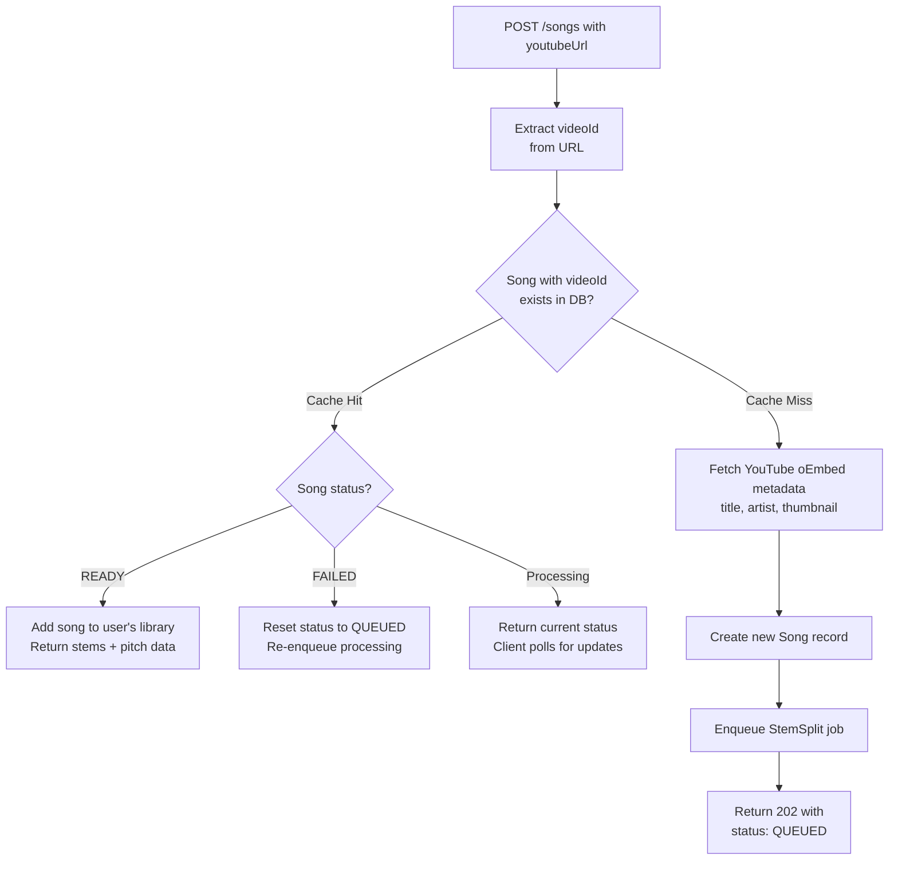

# Intonavio — Audio Processing Pipeline

## Processing Pipeline Overview

End-to-end flow from YouTube URL submission to practice-ready song.



## Job State Machine

States a song goes through during processing.



## Cache Hit vs Cache Miss

Song deduplication avoids redundant processing when multiple users submit the same YouTube video.



---

## StemSplit API Integration

StemSplit offers two flows: **YouTube jobs** (direct URL, 2-stem output) and **file upload jobs** (supports up to 6-stem separation). Intonavio uses the YouTube flow for simplicity.

### Job Creation

```
POST https://stemsplit.io/api/v1/youtube-jobs
Authorization: Bearer <STEMSPLIT_API_KEY>
Content-Type: application/json

{
  "youtubeUrl": "https://www.youtube.com/watch?v=dQw4w9WgXcQ",
  "outputFormat": "MP3",
  "quality": "BEST"
}
```

Note: The YouTube endpoint does **not** accept `outputType` or `webhookUrl`. Webhooks are registered separately via `POST /api/v1/webhooks`. YouTube jobs always produce vocals + instrumental + fullAudio.

### Output Types by Flow

| Flow         | Endpoint        | Available Output Types                      | Stems Produced                                            |
| ------------ | --------------- | ------------------------------------------- | --------------------------------------------------------- |
| YouTube jobs | `/youtube-jobs` | Fixed (vocals + instrumental + fullAudio)   | 3 outputs (2 useful stems)                                |
| File upload  | `/jobs`         | `VOCALS`, `BOTH`, `FOUR_STEMS`, `SIX_STEMS` | Up to 6 stems (vocals, drums, bass, other, piano, guitar) |

### Webhook Registration

Webhooks are registered once via the StemSplit dashboard or API (`POST /api/v1/webhooks`), not per-job. StemSplit sends events for all jobs to the registered URL.

### Webhook Payload

StemSplit uses HMAC-SHA256 signatures for webhook authentication via the `X-Webhook-Signature` header.

```json
{
  "event": "job.completed",
  "timestamp": "2026-01-05T12:30:00Z",
  "data": {
    "jobId": "clxxx123...",
    "status": "COMPLETED",
    "input": {
      "durationSeconds": 240,
      "fileSizeBytes": 4500000
    },
    "outputs": {
      "vocals": {
        "url": "https://stemsplit-storage....r2.cloudflarestorage.com/...",
        "expiresAt": "2026-01-05T13:30:00Z"
      },
      "instrumental": {
        "url": "https://stemsplit-storage....r2.cloudflarestorage.com/...",
        "expiresAt": "2026-01-05T13:30:00Z"
      },
      "fullAudio": {
        "url": "https://stemsplit-storage....r2.cloudflarestorage.com/...",
        "expiresAt": "2026-01-05T13:30:00Z"
      }
    },
    "creditsCharged": 240,
    "createdAt": "2026-01-05T12:00:00Z",
    "completedAt": "2026-01-05T12:02:30Z"
  }
}
```

### Webhook Headers

| Header                | Description                            |
| --------------------- | -------------------------------------- |
| `X-Webhook-Signature` | `sha256=<HMAC-SHA256 of request body>` |
| `X-Webhook-Event`     | Event type (e.g., `job.completed`)     |
| `X-Webhook-Id`        | Webhook endpoint identifier            |

---

## iOS Audio Architecture: Unified AudioEngine

All audio I/O (stem playback + microphone input) runs through a single shared `AudioEngine` instance. This is required for Voice Processing (VPIO/AEC) to work on iOS — the system needs to see both the output going to speakers and the input from the microphone on the same `AVAudioEngine` to cancel speaker bleed from the mic.

### Unified Audio Graph

```
Microphone → inputNode (VP/AEC enabled) ── tap ──→ PitchDetector ring buffer

PlayerNode(vocals)  ──┐
PlayerNode(other)   ──┼→ stemMixer → timePitch → mainMixerNode → output
PlayerNode(full)    ──┘
```

### AudioEngine Lifecycle

1. **`prepare()`** — Configure audio session (`.playAndRecord`, `.measurement`) and enable voice processing on `inputNode`. Must be called before attaching nodes — VP re-creates the audio graph.
2. **Attach nodes** — `StemPlayer.setup()` attaches player nodes, mixer, and timePitch to the prepared engine.
3. **`start()`** — Start the engine with all nodes connected. Observes interruption and route change notifications on iOS. Idempotent — safe to call from multiple consumers.

`StemPlayer`, `PitchDetector`, and `MetronomeTick` all accept a shared `AudioEngine` via init. None creates its own `AVAudioEngine`. The engine starts lazily when stems are set up or pitch detection begins.

### Why One Engine?

Previous architecture used separate engines for `StemPlayer` (output) and `PitchDetector` (input). On iOS, enabling `setVoiceProcessingEnabled(true)` on one engine's input node caused VPIO render errors because both engines competed for audio I/O hardware. With a single engine, VPIO sees the stem output and cancels it from the mic input.

### Audio Route Change Handling

When the audio output route changes (e.g. AirPods connected/disconnected), iOS posts `AVAudioSession.routeChangeNotification`. `AudioEngine` observes this and:

1. Ensures the engine is still running (route changes can stop it)
2. Fires an `onRouteChange` callback so consumers can re-sync playback

`PracticeViewModel` handles the callback by stopping all stems, re-applying the current audio mode volumes, and restarting playback from the current YouTube time. Without this, player nodes lose sync during route changes and all stems become audible at slightly different offsets.

### TimePitch Latency Compensation

`AVAudioUnitTimePitch` introduces processing latency (~125ms) — audio frames take time to pass through the pitch-preserving time-stretch pipeline. `StemPlayer.play(from:)` compensates by scheduling stems ahead by `timePitch.latency`:

```swift
let compensated = time + timePitch.latency
```

This ensures the audio output aligns with the requested playback time after the pipeline delay. The drift checker in `VideoAudioSync` accounts for the same latency when comparing stem position against YouTube time.

### Video-Audio Drift Correction

`VideoAudioSync` polls YouTube time every 2 seconds and compares it with the stem player's current position (adjusted for TimePitch latency). If drift exceeds 150ms, stems are seeked to match YouTube. YouTube is the master clock — stems follow.

### Audio Session Configuration

The audio session uses `.measurement` mode with voice processing enabled on the input node for AEC. All audio routes through stem playback — YouTube audio is not used.

```swift
AVAudioSession.sharedInstance().setCategory(
    .playAndRecord,
    mode: .measurement,  // VP enabled separately on inputNode for AEC
    options: [.defaultToSpeaker, .allowBluetooth, .mixWithOthers]
)
```

Additional pre-detection filtering:

- **RMS noise gate**: `vDSP_rmsqv` (Accelerate) — skip YIN if RMS < 0.01 (~-40 dB)
- **Confidence threshold**: 0.85 (above default 0.80)
- **MIDI jump filter**: Reject >12 semitone jumps within 50ms

---

## Pitch Analysis (Python Worker)

The Python worker extracts reference pitch data from the vocal stem using librosa's pYIN algorithm.

### Pipeline

1. **Download** vocal stem from R2 (`stems/{songId}/VOCALS.mp3`)
2. **Load** audio with librosa at 44.1kHz mono
3. **Extract pitch** using `librosa.pyin()`:
   - `fmin=65` (C2) — lowest expected singing pitch
   - `fmax=2093` (C7) — highest expected singing pitch
   - `hop_length=512` — ~11.6ms resolution
4. **Compute RMS** energy per frame using `librosa.feature.rms()` (same hop length)
5. **Convert** frequencies to MIDI note numbers
6. **Build** JSON frame array with `t`, `hz`, `midi`, `voiced`, `rms` fields
7. **Upload** JSON to R2 at `pitch/{songId}/reference.json`
8. **Update** database: create PitchData record, set song status to READY

### Key Parameters

| Parameter   | Value         | Rationale                                                    |
| ----------- | ------------- | ------------------------------------------------------------ |
| Sample rate | 44,100 Hz     | Standard audio quality                                       |
| Hop length  | 512 samples   | ~11.6ms — matches real-time detection resolution             |
| fmin        | 65 Hz (C2)    | Covers bass vocal range                                      |
| fmax        | 2,093 Hz (C7) | Covers soprano vocal range                                   |
| Algorithm   | pYIN          | More robust than YIN for pre-recorded audio; handles vibrato |

### RMS Energy (Artifact Filtering)

Per-frame RMS energy is computed alongside pitch extraction using `librosa.feature.rms(y=audio, hop_length=512)`. This value is included in the output JSON (`rms` field) and used by iOS/Web clients to filter low-energy artifacts from imperfect stem separation. Frames where `rms < 0.02` are treated as inaudible — excluded from piano roll rendering and MIDI range computation. Without this filtering, pYIN marks residual noise as "voiced" (it has detectable pitch), producing visible artifacts on the piano roll.

---

## Cost Optimization

| Strategy               | Description                                                                      |
| ---------------------- | -------------------------------------------------------------------------------- |
| **Song deduplication** | Same videoId shared across users — process once, serve many                      |
| **R2 storage**         | No egress fees for stem downloads (Cloudflare R2)                                |
| **Lazy processing**    | Only process songs when first requested, not speculatively                       |
| **Format choice**      | MP3 for stems (smaller files, acceptable quality for practice)                   |
| **TTL on failed jobs** | Auto-retry failed jobs up to 3 times, then mark as FAILED                        |
| **StemSplit pricing**  | Credits = audio duration in seconds. ~$0.10/min — a 4-min song costs ~$0.40 once |
