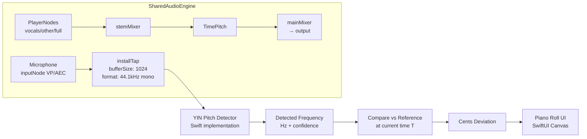
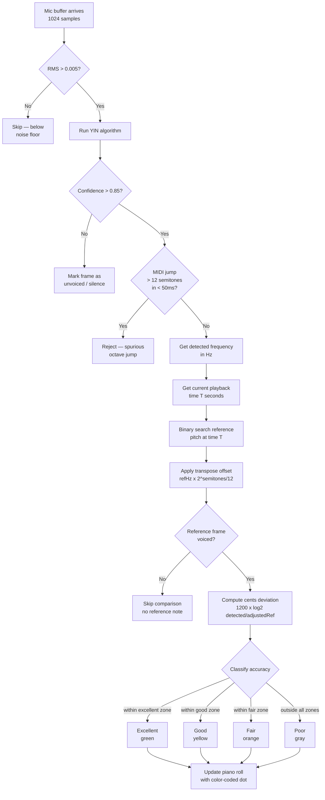
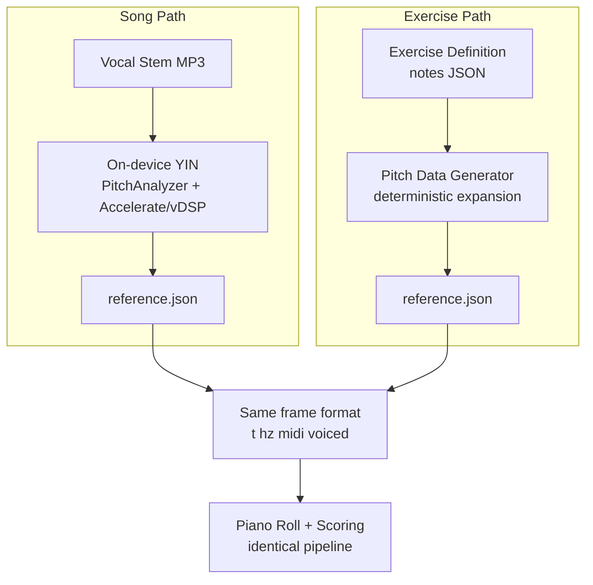

# IntonavioLocal — Real-Time Pitch Detection

## Overview

Real-time pitch detection is the core interactive feature. The app captures the singer's voice via microphone, detects the fundamental frequency (F0), compares it against the reference pitch at the current playback time, and provides visual feedback on a piano roll.

---

## iOS Audio Graph

Stem playback and microphone input share a single `AudioEngine` instance. Voice processing (AEC) on the input node uses the output graph to cancel stem audio from the mic signal.



### Implementation Notes

- A shared **AudioEngine** wraps a single `AVAudioEngine` with voice processing (AEC) enabled on the input node
- **StemPlayer**, **PitchDetector**, and **MetronomeTick** all receive the shared engine via init — none creates its own
- **installTap** with buffer size 1024 at 44.1kHz gives callbacks every ~23ms
- **YIN algorithm** runs synchronously in the tap callback (audio thread)
- Detected pitch is dispatched to main thread for UI update
- The reference pitch array is binary-searched by timestamp for O(log n) lookup
- All audio (including "original" mode) routes through stem playback — YouTube audio is not used
- **Audio route changes** (AirPods connect/disconnect) trigger a full stem re-sync — stops stems, re-applies mode volumes, restarts from current YouTube time
- **TimePitch latency** (~125ms) is compensated in `StemPlayer.play(from:)` by scheduling frames ahead, so audio output aligns with the requested time

### Audio Session: Echo Cancellation

The audio session uses `.measurement` mode with voice processing enabled separately on the input node. Because stem playback and mic input share one engine, VPIO sees the stem output going to speakers and cancels it from the mic input. Without this, the microphone picks up the song's melody and the detected pitch line follows the music rather than the user's voice.

```swift
AVAudioSession.sharedInstance().setCategory(
    .playAndRecord,
    mode: .measurement,  // VP enabled separately on inputNode for AEC
    options: [.defaultToSpeaker, .allowBluetooth, .mixWithOthers]
)
```

### Pre-Detection Filtering

Three filters prevent false detections:

1. **RMS noise gate**: Before running YIN, compute RMS via `vDSP_rmsqv` (Accelerate framework). If RMS < 0.005 (~-46 dB), skip detection entirely. This filters true silence after AEC removes the music.
2. **Confidence threshold**: Set to 0.85 (stricter than the typical 0.80). Rejects low-confidence detections from residual noise.
3. **MIDI jump filter**: Reject detections where MIDI jumps >12 semitones (1 octave) within 50ms of the previous detection. This catches spurious octave jumps from harmonic confusion.

```swift
// Pseudocode for iOS pitch detection (uses shared AudioEngine)
let sharedEngine = AudioEngine()
try sharedEngine.prepare()  // Enable VP before attaching nodes
// ... StemPlayer attaches playback nodes here ...
try sharedEngine.start()

let format = sharedEngine.inputFormat  // Read after VP is enabled

sharedEngine.installInputTap(bufferSize: 1024, format: format) { buffer, time in
    let samples = Array(UnsafeBufferPointer(
        start: buffer.floatChannelData?[0],
        count: Int(buffer.frameLength)
    ))

    // RMS noise gate
    var rms: Float = 0
    vDSP_rmsqv(samples, 1, &rms, vDSP_Length(samples.count))
    guard rms >= 0.005 else { return }

    let (frequency, confidence) = yinDetect(samples, sampleRate: format.sampleRate)

    if confidence > 0.85 {
        DispatchQueue.main.async {
            self.updatePianoRoll(detectedHz: frequency, at: currentPlaybackTime)
        }
    }
}
```

---

## Pitch Comparison Flow



---

## Scoring Thresholds (Difficulty Levels)

Thresholds and point rewards are controlled by `DifficultyLevel` (stored in UserDefaults). The user selects a level in Settings. Default is **Beginner**.

| Category  | Beginner             | Intermediate        | Advanced            | Color  |
| --------- | -------------------- | ------------------- | ------------------- | ------ |
| Excellent | +/-150 cents, 100 pts | +/-25 cents, 100 pts | +/-25 cents, 100 pts | Green  |
| Good      | +/-300 cents, 75 pts  | +/-50 cents, 60 pts  | +/-40 cents, 50 pts  | Yellow |
| Fair      | +/-450 cents, 40 pts  | +/-75 cents, 25 pts  | +/-60 cents, 20 pts  | Orange |
| Poor      | >450 cents, 0 pts   | >75 cents, 0 pts   | >60 cents, 0 pts   | Gray   |

Piano roll zone bands visually reflect the selected difficulty (wider bands = easier). Best scores are tracked per difficulty level via a `difficulty` field on `ScoreRecord` (SwiftData).

**Cents formula (with transpose):**

```
adjustedRefHz = referenceHz x 2^(transposeSemitones / 12)
cents = 1200 x log2(detectedHz / adjustedRefHz)
```

When `transposeSemitones = 0`, this reduces to the standard formula. One semitone = 100 cents.

**Overall session score:**

```
score = (sum of frame scores / number of voiced reference frames) x 100
```

Only frames where the reference vocal is voiced and audible (`rms >= 0.02`) are counted — silence, breaths, instrumental sections, and low-energy stem separation artifacts are excluded.

---

## Reference Pitch Transpose

Users can shift the reference pitch graph up or down by musical intervals to practice in a different vocal register. This is a **visual + scoring shift only** — no audio processing is applied to the playback.

### Available Intervals

| Interval         | Semitones | Label  |
| ---------------- | --------- | ------ |
| 2 octaves down   | -24       | -2 oct |
| Octave down      | -12       | -1 oct |
| Fifth down       | -7        | -5th   |
| Fourth down      | -5        | -4th   |
| Major third down | -4        | -M3    |
| Minor third down | -3        | -m3    |
| Unison (default) | 0         | 0      |
| Minor third up   | +3        | +m3    |
| Major third up   | +4        | +M3    |
| Fourth up        | +5        | +4th   |
| Fifth up         | +7        | +5th   |
| Octave up        | +12       | +1 oct |
| 2 octaves up     | +24       | +2 oct |

### Where Transpose Applies

| Component              | Transposed? | Why                                                    |
| ---------------------- | ----------- | ------------------------------------------------------ |
| Reference zones/lines  | Yes         | MIDI notes shifted by `transposeOffset` on piano roll  |
| Reference Hz (scoring) | Yes         | `refHz x 2^(semitones/12)` before cents calculation    |
| Detected pitch display | No          | User's voice shown at actual position                  |
| MIDI range (Y-axis)    | Yes         | Piano roll range shifts to keep transposed ref visible |
| Audio playback         | No          | No pitch-shifting of stems or YouTube audio            |

### Implementation

- `TransposeInterval` enum (`Audio/Pitch/TransposeInterval.swift`) holds all intervals with `rawValue` as semitone offset
- `PracticeViewModel.transposeSemitones` drives both scoring and rendering
- `ScoringEngine.transposeSemitones` shifts reference before `centsBetween()` calculation
- `PianoRollRenderer.transposeOffset` shifts reference draw positions (zones and lines)
- Transpose resets to 0 when navigating away from practice

---

## Piano Roll Visualization

The piano roll is a scrolling 2D display shared by both song practice and exercise practice views (see `docs/16-ui-views-flow.md`):

- **Y-axis**: Piano keys / MIDI note numbers (pitch), labeled with note names (C4, D4, E4...)
- **X-axis**: Time, scrolling left as playback progresses
- **Current note**: Displayed large on the left side, with cents deviation indicator

### Visualization Modes

The user toggles between 3 modes via a segmented control on the pitch graph:

| Mode             | Reference Display              | User Display                                 | Feel                |
| ---------------- | ------------------------------ | -------------------------------------------- | ------------------- |
| **Zones + Line** | Semi-transparent colored bands | Solid colored line (accuracy colors)         | Clean, analytical   |
| **Two Lines**    | Thin dashed gray line          | Bold colored line (same color scheme)        | Direct comparison   |
| **Zones + Glow** | Semi-transparent bands         | Glowing animated trail, intensity = accuracy | Engaging, game-like |

### Rendering Specs

| Property             | Value                                                                    |
| -------------------- | ------------------------------------------------------------------------ |
| Visible time window  | 8 seconds (4s past + 4s future)                                          |
| Y-axis range         | Dynamic, centered on current note +/-1 octave                            |
| Update rate          | ~43 FPS (matching audio callback rate)                                   |
| Reference bar height | 1 semitone                                                               |
| Dot size             | 4pt                                                                      |
| Transpose offset     | Applied to reference draws only; detected pitch stays at actual position |

### Interactive Browsing Mode

The piano roll supports touch gestures that decouple the displayed time from playback (see `docs/16-ui-views-flow.md` — Piano Roll Touch Gestures for the full state machine).

**Architecture:**

- `PianoRollGestureState` (`@MainActor @Observable`) tracks browsing mode: `isBrowsing`, `browseOffset`, `browseAnchorTime`, and `InteractionPhase` (idle, touching, dragging, momentum, longPressing)
- `PianoRollMomentumEngine` (`@MainActor @Observable`) provides timer-based deceleration at 60fps (friction 0.95/frame, stops below 0.01 threshold)
- `PianoRollGestureOverlay` is a transparent overlay with `DragGesture(minimumDistance: 0)` that classifies gestures and drives state transitions
- Gesture state lives as `@State` on `PianoRollSection` (not on `PracticeViewModel`) — the ViewModel only receives final commands: `pause()`, `seek(to:)`, `play()`, `setupPhraseLoop(phraseIndex:)`

**Visual indicators during browsing:**

| Element            | Normal                    | Browsing                                   |
| ------------------ | ------------------------- | ------------------------------------------ |
| Playhead (center)  | Solid white line          | Dashed white line (increased opacity)      |
| Playback position  | Not shown                 | Dimmed dashed vertical line at actual time |
| Canvas time window | Centered on playback time | Centered on browsed time (anchor + offset) |

**Position-to-time conversion:**

```
touchTime = centerTime - windowDuration/2 + (x / canvasWidth) x windowDuration
dragOffset = -(translation.width / canvasWidth) x windowDuration
```

**Long press phrase lookup:** `referenceStore.phrase(at: touchTime)` finds the phrase under the finger. If no exact match, the nearest phrase within +/-2 seconds is selected. Haptic feedback on iOS (light impact on touch, medium on loop creation, rigid on no phrase found).

---

## Buffer Size vs Latency Tradeoffs

| Buffer Size | Duration @ 44.1kHz | Frequency Resolution | Latency  | Use Case                               |
| ----------- | ------------------ | -------------------- | -------- | -------------------------------------- |
| 512         | 11.6ms             | ~86 Hz               | Very low | Too imprecise below ~170 Hz            |
| **1024**    | **23.2ms**         | **~43 Hz**           | **Low**  | **Best balance for singing (default)** |
| 2048        | 46.4ms             | ~21 Hz               | Medium   | Better for bass voices                 |
| 4096        | 92.9ms             | ~10 Hz               | High     | Too sluggish for real-time feedback    |

**Why 1024?**

- 23ms latency is imperceptible for visual feedback
- 43 Hz resolution covers notes down to ~F1, well below typical singing range
- YIN at 1024 samples completes in <1ms on modern hardware

---

## YIN Algorithm Summary

YIN is an autocorrelation-based pitch detection algorithm optimized for monophonic audio (single voice).

**Steps:**

1. Compute the difference function (autocorrelation variant)
2. Cumulative mean normalized difference
3. Absolute threshold (tau where d'(tau) < threshold)
4. Parabolic interpolation for sub-sample accuracy
5. Convert lag to frequency: `f = sampleRate / lag`

**Usage in IntonavioLocal:**

| Context              | Algorithm | Purpose                                                   |
| -------------------- | --------- | --------------------------------------------------------- |
| **Real-time (mic)**  | YIN       | Fast, low-latency pitch detection during practice         |
| **Batch (reference)**| YIN       | On-device reference pitch extraction from vocal stem      |

Both real-time and batch analysis use the same YIN algorithm implementation (`YINDetector`), with different parameters:

- **Real-time**: 1024-sample buffer from mic tap, optimized for low latency
- **Batch**: 2048-sample window with 512-sample hop over the entire vocal stem file, optimized for accuracy

The batch analysis runs on-device via `PitchAnalyzer` using Accelerate/vDSP. See `docs/05-audio-pipeline.md` for the full pipeline and `docs/yin-comparison-results.md` for accuracy comparison data.

---

## Reference Pitch Sources

The piano roll and scoring pipeline consume the same `{t, hz, midi, voiced, rms}` frame array regardless of whether the reference comes from a song or an exercise. The only difference is how the reference is produced.



### Exercise Pitch Data Generation

The generator expands an exercise note definition (see `docs/04-data-models.md`) into frame-by-frame pitch data at the same 11.6ms hop interval used by YIN extraction.

**Algorithm:**

1. Read exercise `notes` array and `tempo` (BPM)
2. Convert beat durations to seconds: `seconds = beats x 60 / tempo`
3. For each note, generate frames at 11.6ms intervals:
   - **Sustained note**: all frames at `baseHz = 440 x 2^((midi - 69) / 12)`
   - **With vibrato**: modulate each frame: `hz = baseHz x 2^(vibratoCents x sin(2pi x rateHz x t) / 1200)`
   - **Rest period**: generate unvoiced frames (`hz: null, voiced: false`)
4. Write the complete frame array as the same JSON format used by songs

**Example: C4 sustained for 2 beats at 80 BPM with vibrato**

- Duration: 2 x 60/80 = 1.5 seconds = ~129 frames
- Base frequency: 261.63 Hz (MIDI 60)
- Each frame: `hz = 261.63 x 2^(30 x sin(2pi x 5.5 x t) / 1200)`

The result is a smooth pitch curve that oscillates +/-30 cents around C4 at 5.5 Hz — the singer must match this curve to score well on vibrato exercises.

### Why This Works

The client never needs to know whether it's practicing a song or an exercise. It loads a reference pitch JSON, plays back (stems for songs, metronome/guide tone for exercises), captures the singer's pitch, and compares frame by frame. The piano roll renders identically in both cases.

---

## Reference Pitch RMS Filtering

Vocal stems from stem separation contain low-energy residual noise from other instruments. The YIN algorithm may mark these as "voiced" because they have detectable pitch, but they are artifacts — not real vocal signal. The `rms` field in each pitch frame enables filtering them out.

### How It Works

1. **Analysis side**: `vDSP_rmsqv` computes per-frame energy alongside YIN pitch extraction using the same window. Values are included in the JSON output.
2. **Client side**: Frames with `rms < 0.02` are considered "inaudible" and excluded from:
   - Piano roll rendering (no reference zones/lines drawn for inaudible frames)
   - MIDI range computation (prevents artifacts from expanding the Y-axis range)
   - Scoring (inaudible reference frames are treated like unvoiced frames)

### Threshold Selection

The threshold of `0.02` was chosen empirically. In tested vocal stems, real vocal signal has RMS values > 0.05, while stem separation artifacts typically have RMS values in the range 0.0001-0.001.

### Pitch Data Storage

Pitch data is stored locally at `Documents/pitch/{songId}/reference.json`. The data persists across sessions. If a user wants to re-analyze pitch data (e.g., after an app update improves the algorithm), they can delete and reprocess the song.

---

## Loop Scoring

When an A-B loop is active, the scoring engine provides per-pass feedback to show improvement over repeated practice.

### Per-Pass Scoring Flow

1. User sets markers A and B -> loop state becomes `.looping`
2. `ScoringEngine.reset()` clears accumulated scores for the new loop
3. Playback proceeds from A to B, scoring each detected pitch against the reference
4. When `currentTime >= B`, before seeking back to A:
   - Capture `scoringEngine.overallScore` as the pass score
   - Compare to the previous pass score -> compute improvement (better/worse/same)
   - Reset the scoring engine for the next pass
   - Show a toast overlay with score and delta (auto-dismisses after 2 seconds)
5. Increment `loopCount` and seek back to A

### MIDI Range Recalibration

When a loop is activated, the piano roll's Y-axis range recalibrates to the looped section's pitch range (with +/-3 semitone padding) instead of using the full song's range. This zooms in to show the relevant notes for the section being practiced. The range reverts to full-song when the loop is cleared.
