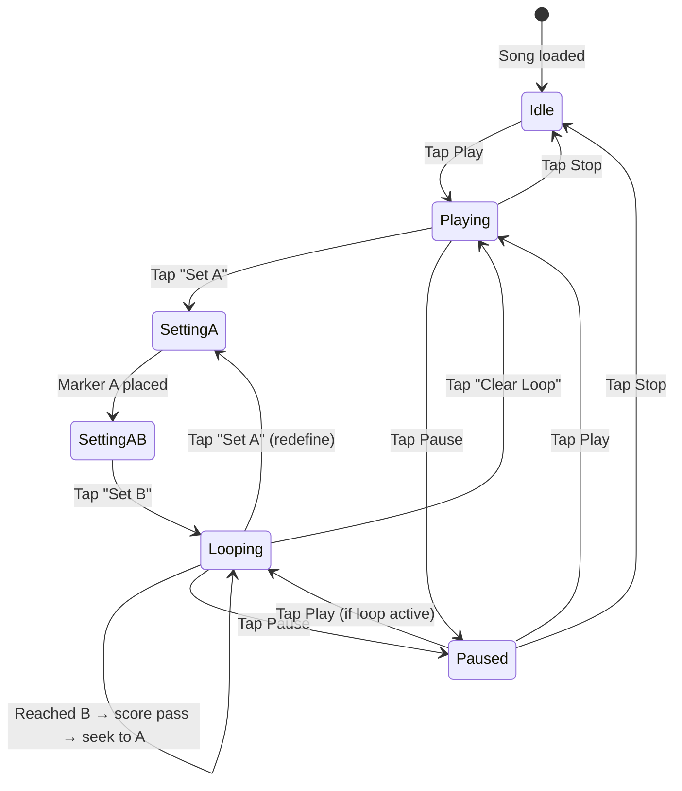
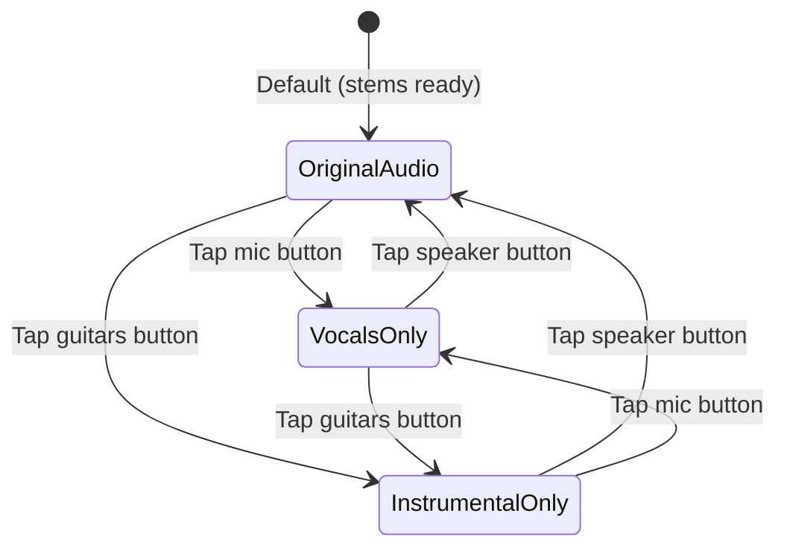
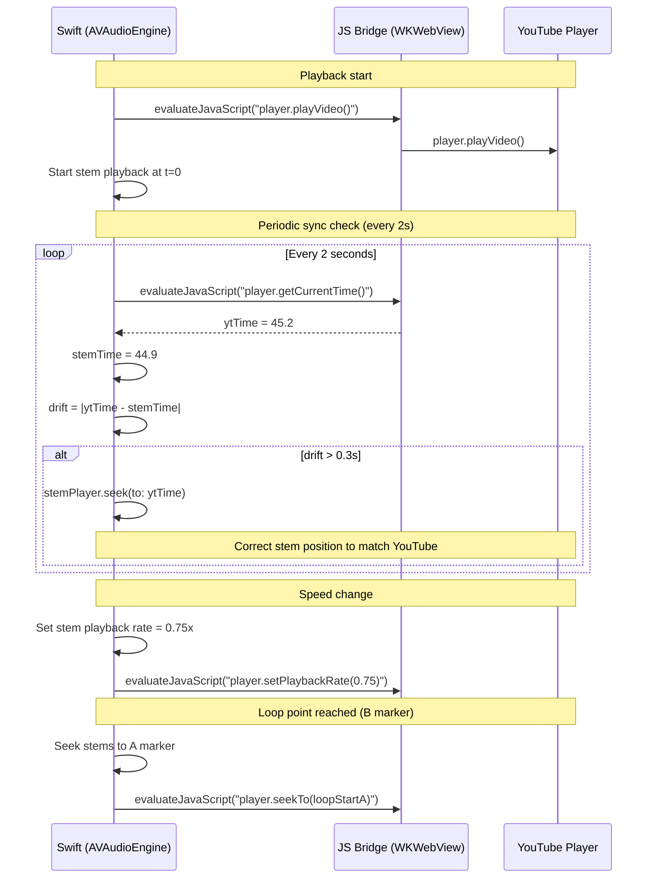

# IntonavioLocal — YouTube Looping & Playback

## Overview

IntonavioLocal embeds YouTube lyrics videos and provides A-B looping and the ability to switch between original audio and separated stems. On iOS, YouTube playback happens in a WKWebView using the YouTube IFrame Player API, controlled via a Swift <-> JavaScript bridge. A transparent overlay blocks direct user interaction with the YouTube player's built-in controls — all playback is controlled via the app's controls bar.

---

## Loop State Machine



### State Descriptions

| State         | Description                                                                                       |
| ------------- | ------------------------------------------------------------------------------------------------- |
| **Idle**      | Song loaded, not playing. No loop markers set.                                                    |
| **Playing**   | Video/stems playing without loop.                                                                 |
| **SettingA**  | User tapped "Set A" — marker A placed at current time. Waiting for B.                             |
| **SettingAB** | Both A and B positions known. Not yet looping (transition state).                                 |
| **Looping**   | Playback loops between A and B. On reaching B, captures pass score, shows toast, seeks back to A. |
| **Paused**    | Playback paused. Loop markers preserved.                                                          |

### Phrase Loop Setup

Phrase loops can be triggered two ways: tapping a phrase in the Progress sheet, or long-pressing (~1s) on the piano roll at the phrase's time position. Both call `setupPhraseLoop(phraseIndex:)` which sets up an A-B loop without starting playback:

1. All playback is stopped (stems, pitch detection, sync, time polling).
2. Marker A is placed before the phrase start with up to 1.5 s of breathing room. If the previous phrase's `endTime` falls within that window, marker A is placed at the previous phrase's end to avoid hearing its tail.
3. Marker B is placed at the phrase's `endTime`.
4. YouTube is paused and seeked atomically (`pauseVideo(); seekTo()` in a single JS evaluation) to avoid a race where `seekTo` resumes playback before the pause takes effect.
5. Piano roll MIDI range recalibrates to the phrase's vocal range.
6. State is set to **Paused** — the user presses Play to begin looping.

---

## Audio Mode State

Switching between audio modes. YouTube is video-only — all audio routes through stem playback via the shared `AudioEngine`.



### Audio Modes

| Mode                  | YouTube Audio | Stem Playback           | Use Case                                            | UI Control             |
| --------------------- | ------------- | ----------------------- | --------------------------------------------------- | ---------------------- |
| **Original Audio**    | Muted         | FULL stem (full mix)    | Default playback — consistent volume with all modes | Speaker icon button    |
| **Vocals Only**       | Muted         | Vocals stem only        | Listen to reference vocal isolated                  | Microphone icon button |
| **Instrumental Only** | Muted         | All stems except vocals | Sing along without competing vocal                  | Guitars icon button    |

YouTube audio is always muted. All audio comes from stems played through the shared `AudioEngine`. This ensures voice processing (AEC) can reference the stem output and cancel it from the microphone input for pitch detection.

Audio source buttons appear inline in the controls bar (next to A-B loop controls) once stems are downloaded.

**FULL stem audio**: All songs include a `FULL` stem type — StemSplit's `fullAudio` output stored locally alongside vocals/instrumental. YouTube plays muted for video-only; all audio routes through `StemPlayer` on the shared `AudioEngine`.

**Mode switching uses pause-switch-resume:** stop sync -> stop stems -> change mode/volumes -> restart stems from current YouTube time -> restart sync. This prevents race conditions where the sync system sees inconsistent state during transitions.

---

## Video-Audio Sync Flow

When playing stems instead of YouTube audio, the video must stay in sync with stem playback.



### Sync Rules

- **YouTube is the master clock** — stem audio follows it. This prevents stems restarting at time 0 from pulling the video back to the beginning during mode switches.
- Drift tolerance: **+/-300ms**. Beyond this, stems seek to match YouTube time. The 300ms threshold prevents constant micro-corrections (150ms triggered corrections every cycle due to inherent JS bridge latency).
- Sync poll interval: **2 seconds**. Frequent polling (1s) caused excessive corrections without improving perceived sync.
- Speed changes are applied to both stem playback (`AVAudioUnitTimePitch.rate`) and YouTube player (`setPlaybackRate()`) simultaneously.
- On loop restart (B->A), both stem and video seek to marker A.
- `AVAudioSession` uses `.mixWithOthers` option so YouTube WebView and the shared AVAudioEngine coexist without triggering interruption notifications.

---

## Speed Control

Speed control is available programmatically (0.25x-2.0x) but the speed selector UI has been removed from the practice screen controls bar to reduce clutter. Speed defaults to 1.0x.

Speed is applied via:

- **AVAudioEngine**: `audioPlayerNode.rate = speed` (using AVAudioUnitTimePitch to preserve pitch)
- **YouTube**: `player.setPlaybackRate(speed)` — YouTube supports 0.25x-2x natively

---

## YouTube Video Touch Blocking

The YouTube player's WKWebView is covered by a transparent SwiftUI overlay (`Color.clear.contentShape(Rectangle())`) that absorbs all touch events. This prevents users from interacting with YouTube's built-in play/pause button, seek bar, and other controls. All playback is exclusively controlled through the app's controls bar, ensuring consistent state between the YouTube player, stem player, pitch detection, and loop logic.

Note: The piano roll area below the video _is_ touch-interactive — it has its own gesture overlay for touch-to-pause, swipe-to-scrub, and long-press-to-loop (see `docs/16-ui-views-flow.md` — Piano Roll Touch Gestures). Only the YouTube video area blocks touch events.

---

## iOS Implementation: WKWebView + YouTube IFrame API

### HTML Template (loaded in WKWebView)

```html
<!DOCTYPE html>
<html>
  <body style="margin:0; background:#000;">
    <div id="player"></div>
    <script src="https://www.youtube.com/iframe_api"></script>
    <script>
      var player;
      function onYouTubeIframeAPIReady() {
        player = new YT.Player('player', {
          videoId: 'VIDEO_ID',
          playerVars: { controls: 0, modestbranding: 1, rel: 0, playsinline: 1 },
          events: { onReady: onPlayerReady, onStateChange: onPlayerStateChange },
        });
      }
      function onPlayerReady(e) {
        window.webkit.messageHandlers.ytEvent.postMessage({ event: 'ready' });
      }
      function onPlayerStateChange(e) {
        window.webkit.messageHandlers.ytEvent.postMessage({
          event: 'stateChange',
          state: e.data,
        });
      }
    </script>
  </body>
</html>
```

### Swift <-> JS Bridge

| Direction  | Method                                               | Purpose            |
| ---------- | ---------------------------------------------------- | ------------------ |
| Swift -> JS | `evaluateJavaScript("player.playVideo()")`           | Control playback   |
| Swift -> JS | `evaluateJavaScript("player.seekTo(time)")`          | Seek to time       |
| Swift -> JS | `evaluateJavaScript("player.setPlaybackRate(rate)")` | Change speed       |
| Swift -> JS | `evaluateJavaScript("player.getCurrentTime()")`      | Read position      |
| Swift -> JS | `evaluateJavaScript("player.mute()")`                | Mute YouTube audio |
| JS -> Swift | `WKScriptMessageHandler` (`ytEvent`)                 | Player events      |

---

## Keyboard / Gesture Shortcuts

### iOS (Touch)

| Gesture                | Action                  |
| ---------------------- | ----------------------- |
| Tap play/pause         | Toggle playback         |
| Long press on timeline | Set A marker            |
| Second long press      | Set B marker            |
| Double-tap loop badge  | Clear loop              |
| Pinch timeline         | Zoom in/out on waveform |
| Swipe left/right       | Scrub +/-5 seconds      |

### macOS (Keyboard)

| Key                    | Action                     |
| ---------------------- | -------------------------- |
| `Space`                | Play / Pause               |
| `[`                    | Set A marker               |
| `]`                    | Set B marker               |
| `Backspace`            | Clear loop                 |
| `Left` / `Right`      | Seek +/-5 seconds          |
| `Shift+Left` / `Right`| Seek +/-1 second           |
| `-` / `+`             | Decrease / increase speed  |
