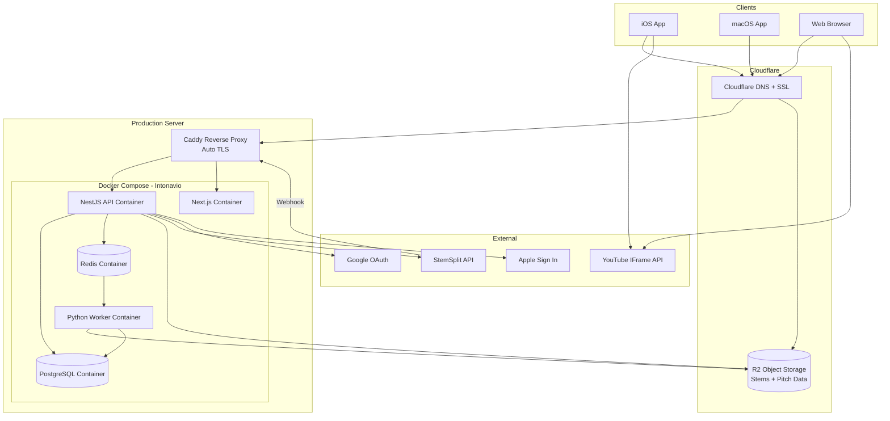
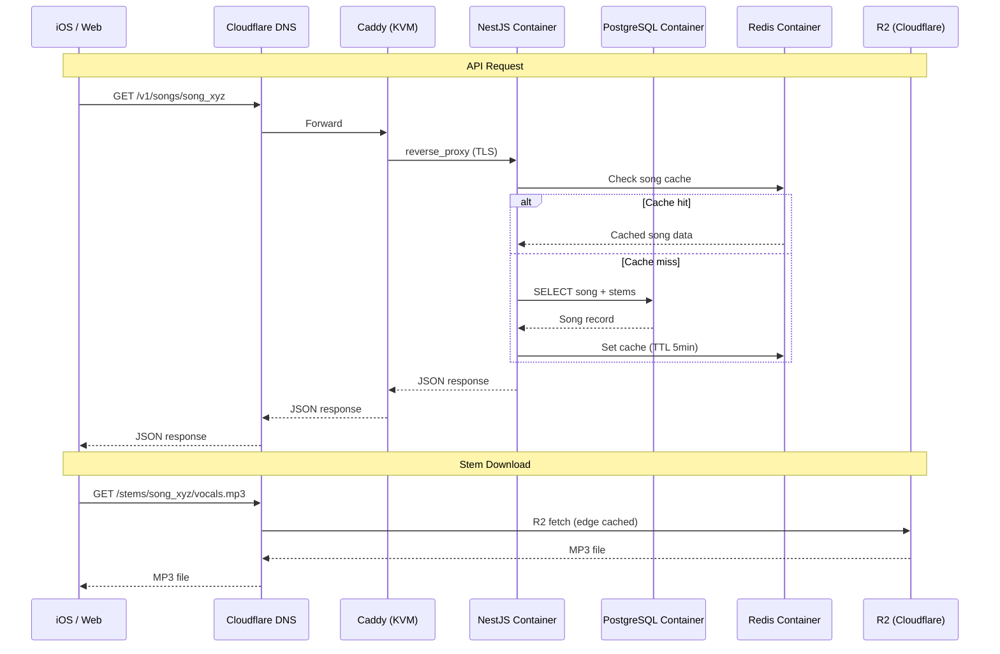

# Intonavio — Infrastructure

## Deployment Diagram



## Request Flow



---

## Infrastructure Components

### Production Server

Single VPS running all backend services via Docker Compose.

| Resource    | Spec             | Notes                                   |
| ----------- | ---------------- | --------------------------------------- |
| **CPU**     | 4+ vCPU          | pYIN analysis is CPU-bound              |
| **RAM**     | 8+ GB            | PostgreSQL + Redis + API + Worker + Web |
| **Storage** | 100+ GB SSD      | PostgreSQL data, Docker images, logs    |
| **OS**      | Ubuntu 24.04 LTS | Docker-compatible                       |
| **Network** | 1 Gbps           | Sufficient for API traffic              |

### Reverse Proxy

Caddy runs as a reverse proxy handling automatic TLS certificate provisioning and renewal. Intonavio containers join a shared Docker network so Caddy can route to them by container name.

### Docker Services

| Container  | Image                | Port | Purpose                          |
| ---------- | -------------------- | ---- | -------------------------------- |
| `api`      | Custom (Node.js 20)  | 3000 | NestJS REST API                  |
| `web`      | Custom (Node.js 20)  | 3001 | Next.js SSR                      |
| `worker`   | Custom (Python 3.11) | —    | Pitch analysis (no exposed port) |
| `postgres` | `postgres:16-alpine` | 5432 | Primary database                 |
| `redis`    | `redis:7-alpine`     | 6379 | BullMQ queue + cache             |

### External Services

| Service             | Provider          | Purpose                                              |
| ------------------- | ----------------- | ---------------------------------------------------- |
| **Object Storage**  | Cloudflare R2     | Stems (MP3), pitch data (JSON) — no egress fees      |
| **DNS + CDN**       | Cloudflare        | DNS, DDoS protection, R2 public access               |
| **TLS**             | Caddy (automatic) | Auto-provisioned and auto-renewed HTTPS certificates |
| **Stem Separation** | StemSplit API     | Audio source separation                              |

---

## Docker Compose Overview

The production compose file defines all backend services.

Currently deployed: **API + Worker + PostgreSQL + Redis** (web not yet implemented).

```yaml
# docker-compose.yml (production)
services:
  api:
    build:
      context: .
      dockerfile: apps/api/Dockerfile
    env_file: .env.production
    depends_on:
      postgres:
        condition: service_started
      redis:
        condition: service_started
    restart: unless-stopped
    networks: [default, stack_appnet]

  worker:
    build:
      context: ./workers/pitch-analyzer
      dockerfile: Dockerfile
    env_file: .env.production
    depends_on:
      postgres:
        condition: service_started
      redis:
        condition: service_started
    restart: unless-stopped
    deploy:
      resources:
        limits:
          cpus: '2.0'
          memory: 2G

  # web: not yet implemented

  postgres:
    image: postgres:16-alpine
    volumes: [postgres_data:/var/lib/postgresql/data]
    env_file: .env.production
    restart: unless-stopped

  redis:
    image: redis:7-alpine
    volumes: [redis_data:/var/lib/redis/data]
    command: redis-server --appendonly yes
    restart: unless-stopped

networks:
  stack_appnet:
    external: true

volumes:
  postgres_data:
  redis_data:
```

### API Dockerfile

The API Dockerfile uses a multi-stage build optimized for pnpm workspaces:

1. **deps** — installs all dependencies with `pnpm install --frozen-lockfile`
2. **builder** — copies source, builds shared package + API, generates Prisma client
3. **runner** — copies `node_modules` (with generated Prisma client), `dist`, and `prisma` from builder

Key details:

- `HUSKY=0` in deps stage to skip Git hooks in Docker
- `tsconfig.base.json` must be copied (both API and shared extend it)
- Full `node_modules` copied to runner (pnpm deploy doesn't work well with Prisma generated client in the virtual store)
- `prisma generate` runs before `pnpm build` (TypeScript needs generated types)
- `WORKDIR /app/apps/api` in runner so `dist/main.js` resolves correctly

---

## Caddy Configuration

Caddy handles TLS termination and reverse proxying. Example Caddyfile entries:

```caddyfile
app.example.com {
    reverse_proxy intonavio-web-1:3001
    encode gzip zstd
}

api.example.com {
    reverse_proxy intonavio-api-1:3000
    encode gzip zstd
}
```

Caddy automatically provisions and renews TLS certificates for these domains. No manual certificate management needed.

---

## Environments

| Environment    | Infrastructure             | Database                                | Purpose                 |
| -------------- | -------------------------- | --------------------------------------- | ----------------------- |
| **Local dev**  | `docker-compose.dev.yml`   | PostgreSQL + Redis containers           | Development and testing |
| **Production** | VPS + `docker-compose.yml` | PostgreSQL container with volume backup | Live service            |

### Local Development

```yaml
# docker-compose.dev.yml — only infrastructure services
services:
  postgres:
    image: postgres:16-alpine
    ports: ['5432:5432']
    environment:
      POSTGRES_DB: intonavio_dev
      POSTGRES_USER: dev
      POSTGRES_PASSWORD: dev
    volumes: [postgres_dev:/var/lib/postgresql/data]

  redis:
    image: redis:7-alpine
    ports: ['6379:6379']

volumes:
  postgres_dev:
```

API, Web, and Worker run natively via `pnpm dev` (not containerized in dev) for fast iteration and hot reload.

---

## Cost Estimates (Monthly)

### At Launch (~100 users, ~500 songs)

| Item           | Cost      | Notes                             |
| -------------- | --------- | --------------------------------- |
| VPS            | ~$15–25   | 4 vCPU, 8GB RAM                   |
| Cloudflare R2  | ~$2       | ~150GB stems storage              |
| Cloudflare DNS | $0        | Free plan                         |
| Domain         | ~$1       | Annual amortized                  |
| StemSplit API  | ~$80      | 500 songs × avg 4 min × $0.04/min |
| **Total**      | **~$100** | StemSplit dominates costs         |

### At Scale (~5,000 users, ~10,000 songs)

| Item          | Cost      | Notes                                  |
| ------------- | --------- | -------------------------------------- |
| VPS           | ~$40–60   | Upgrade to 8 vCPU, 16GB RAM            |
| Cloudflare R2 | ~$45      | ~3TB stems                             |
| StemSplit API | ~$400     | 1,000 new songs/mo × 4 min × $0.10/min |
| **Total**     | **~$500** |                                        |

---

## Scaling Considerations

### Vertical Scaling

- **First approach**: Upgrade VPS plan (more CPU, RAM, SSD)
- PostgreSQL and Redis performance scales well vertically up to ~16 vCPU
- Docker resource limits ensure the worker doesn't starve the API

### Horizontal Scaling (When Needed)

If the single VPS is no longer sufficient:

- **API**: Run multiple API containers behind Caddy with round-robin load balancing
- **Worker**: Run additional worker containers (BullMQ supports multiple consumers)
- **Database**: Move PostgreSQL to a managed service (Supabase, Neon) when the VPS can't handle DB + app load together
- **Split services**: Move the Python worker to a second VPS dedicated to CPU-intensive pitch analysis

### Backup Strategy

| What              | How                                         | Frequency    |
| ----------------- | ------------------------------------------- | ------------ |
| PostgreSQL        | `pg_dump` to compressed file → upload to R2 | Daily (cron) |
| Redis             | RDB snapshots (appendonly enabled)          | Automatic    |
| Docker volumes    | Volume backup script → R2                   | Weekly       |
| `.env.production` | Encrypted backup in private GitHub repo     | On change    |

### Monitoring

- **Uptime**: Health check endpoint (`GET /health`) polled by external monitor (UptimeRobot free tier or GitHub Actions cron)
- **Logs**: Docker logs with `json-file` driver, rotated and retained for 7 days
- **Disk**: Cron alert if disk usage exceeds 80%
- **Container restarts**: `restart: unless-stopped` + Docker daemon auto-start on boot
