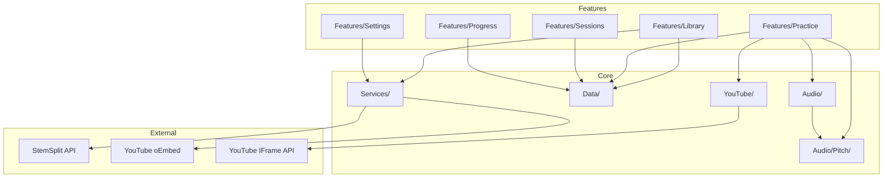

# IntonavioLocal — Project Structure

## Repository Layout

```
IntonavioLocal/
├── apps/
│   └── ios/
│       ├── project.yml                    # XcodeGen project definition
│       ├── GeneralUser-GS.sf2             # SoundFont for guide tone instrument
│       ├── IntonavioLocal.xcodeproj       # Generated by XcodeGen
│       ├── Intonavio/
│       │   ├── Info.plist                 # iOS Info.plist
│       │   ├── Info-macOS.plist           # macOS Info.plist
│       │   ├── Intonavio.entitlements     # iOS entitlements
│       │   ├── IntonavioMac.entitlements  # macOS entitlements
│       │   ├── Resources/                 # Asset catalogs, etc.
│       │   ├── App/
│       │   │   ├── IntonavioApp.swift     # @main entry point
│       │   │   ├── ContentView.swift      # TabView (Library, Sessions, Settings)
│       │   │   ├── AppState.swift         # @Observable: selected tab, app-wide state
│       │   │   ├── AppTheme.swift         # Theme management (@AppStorage)
│       │   │   └── DesignSystem.swift     # Split Spectrum design tokens (colors, gradients, styles)
│       │   ├── Features/
│       │   │   ├── Library/
│       │   │   │   ├── HomeView.swift             # Song grid + exercise sections
│       │   │   │   ├── AddSongSheet.swift          # YouTube URL input + submit
│       │   │   │   ├── SongGridItemView.swift      # Thumbnail, title, status badge
│       │   │   │   ├── SongStatusBadge.swift       # Color-coded processing status
│       │   │   │   ├── ExerciseBrowserView.swift   # Exercise categories
│       │   │   │   ├── ExerciseSectionView.swift   # Horizontal scroll section
│       │   │   │   └── LibraryViewModel.swift      # Fetch songs, add song, processing
│       │   │   ├── Practice/
│       │   │   │   ├── SongPracticeView.swift               # YouTube video + piano roll + controls
│       │   │   │   ├── ExercisePracticeView.swift            # Exercise practice: metronome + piano roll + scoring
│       │   │   │   ├── ExercisePracticeViewModel.swift       # Exercise playback timer, pitch detection, scoring
│       │   │   │   ├── PracticeViewModel.swift               # Playback state, loop machine, transpose, sync
│       │   │   │   ├── PracticeViewModel+Audio.swift         # Audio mode switching (pause-switch-resume)
│       │   │   │   ├── PracticeViewModel+Loop.swift          # A-B loop check task
│       │   │   │   ├── PracticeViewModel+Pitch.swift         # Pitch detection lifecycle, jump filter, transpose
│       │   │   │   ├── PracticeViewModel+Phrases.swift       # Phrase-level scoring
│       │   │   │   ├── PracticeLayoutMode.swift              # Enum: lyricsFocused (65/35), pitchFocused (25/75)
│       │   │   │   ├── ControlsBarView.swift                 # Timeline + transport + source/loop + speed + transpose
│       │   │   │   ├── PlaybackControlsView.swift            # Skip back, play/pause, skip forward
│       │   │   │   ├── LoopControlsView.swift                # A/B markers, clear loop, loop count
│       │   │   │   ├── TimelineBarView.swift                 # Scrubber with A/B markers
│       │   │   │   ├── SpeedSelectorView.swift               # 0.25x-2.0x discrete speed steps
│       │   │   │   ├── LoopState.swift                       # Enum: idle, playing, settingA, settingAB, looping, paused
│       │   │   │   ├── LoopScoreToastView.swift              # Score toast after loop completion
│       │   │   │   ├── PhraseScoreToastView.swift            # Score toast after phrase completion
│       │   │   │   └── PianoRoll/
│       │   │   │       ├── PianoRollView.swift               # Container: mode selector, piano keys, canvas, current note
│       │   │   │       ├── PianoRollCanvas.swift             # SwiftUI Canvas: grid, reference, detected pitch
│       │   │   │       ├── PianoRollRenderer.swift           # Static draw helpers: zones, lines, glow, transposeOffset
│       │   │   │       ├── PianoRollGestureState.swift       # @Observable browsing state
│       │   │   │       ├── PianoRollGestureOverlay.swift     # Touch/drag/long-press gesture overlay
│       │   │   │       ├── PianoRollMomentumEngine.swift     # Timer-based deceleration for momentum scrolling
│       │   │   │       ├── CurrentNoteView.swift             # Large note name + cents deviation indicator
│       │   │   │       ├── DetectedPitchPoint.swift          # Struct: time, midi, accuracy, cents
│       │   │   │       ├── PitchDebugOverlay.swift           # DEBUG: Hz, confidence, MIDI, FPS, scoring
│       │   │   │       └── VisualizationMode.swift           # Enum: zonesLine, twoLines, zonesGlow
│       │   │   ├── Progress/
│       │   │   │   ├── ProgressLogView.swift                 # Score history view
│       │   │   │   └── PhraseScoreRowView.swift              # Individual phrase score row
│       │   │   ├── Sessions/
│       │   │   │   ├── SessionHistoryView.swift              # List with infinite scroll
│       │   │   │   ├── SessionDetailView.swift               # Score, duration, loop points
│       │   │   │   ├── SessionRowView.swift                  # Date, song, duration, score
│       │   │   │   └── SessionsViewModel.swift               # Fetch sessions from SwiftData
│       │   │   └── Settings/
│       │   │       ├── SettingsView.swift                    # Audio, theme, API key, about
│       │   │       ├── SettingsViewModel.swift               # Settings state management
│       │   │       ├── APIKeySettingsView.swift              # StemSplit API key input
│       │   │       ├── GuideToneSettingsView.swift           # Guide tone instrument picker
│       │   │       └── DeveloperView.swift                   # Debug tools (dev builds only)
│       │   ├── Audio/
│       │   │   ├── AudioEngine.swift           # Shared AVAudioEngine: VP/AEC, lifecycle, input taps
│       │   │   ├── StemPlayer.swift             # Stem playback nodes on shared AudioEngine
│       │   │   ├── VideoAudioSync.swift         # YouTube-as-master sync (150ms threshold, 2s polls)
│       │   │   ├── AudioMode.swift              # Enum: original, vocalsOnly, instrumental
│       │   │   ├── MetronomeTick.swift          # Click sound on shared AudioEngine
│       │   │   ├── GuideTone.swift              # Guide tone playback
│       │   │   ├── GuideToneInstrument.swift    # Guide tone instrument definitions
│       │   │   └── Pitch/
│       │   │       ├── AudioSessionManager.swift       # AVAudioSession config, interruptions
│       │   │       ├── PitchTypes.swift                # PitchResult, PitchConstants (thresholds, RMS, jump)
│       │   │       ├── NoteMapper.swift                # Hz<->MIDI<->cents conversions
│       │   │       ├── YINDetector.swift               # 5-step YIN with Accelerate vDSP
│       │   │       ├── PitchDetector.swift             # @Observable: mic tap on shared AudioEngine
│       │   │       ├── DifficultyLevel.swift           # Enum: beginner/intermediate/advanced
│       │   │       ├── PitchAccuracy.swift             # Enum: excellent/good/fair/poor/unvoiced
│       │   │       ├── ScoringEngine.swift             # Cents comparison + transpose + score accumulation
│       │   │       ├── TransposeInterval.swift         # Enum: musical intervals (-24 to +24 semitones)
│       │   │       ├── ReferencePitchFrame.swift       # Codable frame struct
│       │   │       ├── ReferencePitchStore.swift       # O(1) frame lookup by time, range queries
│       │   │       ├── ExercisePitchGenerator.swift    # Reference pitch from exercise definitions
│       │   │       ├── ExerciseDefinitions.swift       # Bundled scales, arpeggios, intervals
│       │   │       ├── PhraseScoreResult.swift         # Phrase scoring result struct
│       │   │       └── PitchRecorder.swift             # DEBUG: raw mic + detected pitch to disk
│       │   ├── Data/
│       │   │   ├── Models/
│       │   │   │   ├── SongModel.swift          # @Model: song metadata + status + relationships
│       │   │   │   ├── StemModel.swift           # @Model: stem type + local file path
│       │   │   │   └── SessionModel.swift        # @Model: practice session + pitch log
│       │   │   ├── ScoreRecord.swift             # @Model: per-song/phrase score tracking
│       │   │   ├── ScoreRepository.swift         # Score CRUD, personal best lookups
│       │   │   └── SharedTypes.swift             # SongStatus, StemType, PitchLogEntry enums/structs
│       │   ├── Services/
│       │   │   ├── SongProcessingService.swift   # Pipeline orchestrator (async Task)
│       │   │   ├── StemSplitService.swift         # Direct StemSplit API calls (URLSession)
│       │   │   ├── YouTubeMetadataService.swift   # YouTube oEmbed + thumbnail resolution
│       │   │   ├── PitchAnalyzer.swift            # On-device YIN batch pitch extraction
│       │   │   ├── LocalStorageService.swift      # Documents directory path management
│       │   │   └── KeychainService.swift          # Secure API key storage
│       │   ├── YouTube/
│       │   │   ├── YouTubePlayerView.swift        # SwiftUI WKWebView wrapper
│       │   │   ├── YouTubePlayerController.swift  # Playback control via JS bridge
│       │   │   ├── YouTubeBridge.swift            # WKScriptMessageHandler (ytEvent)
│       │   │   ├── YouTubeHTML.swift              # IFrame API HTML template
│       │   │   ├── YouTubeLocalServer.swift       # WKURLSchemeHandler for local HTML
│       │   │   ├── VideoPlayerProtocol.swift      # Protocol for player abstraction
│       │   │   └── WebViewPrewarmer.swift         # Pre-warm WKWebView with canvas keep-alive
│       │   └── Utilities/
│       │       ├── Logger.swift                   # os.Logger wrapper (AppLogger)
│       │       ├── DriftLogger.swift              # Debug-build sync drift logging
│       │       ├── PlatformColors.swift           # Cross-platform color helpers
│       │       ├── PlatformModifiers.swift        # Cross-platform view modifiers
│       │       └── YouTubeURLValidator.swift      # YouTube URL regex validation
│       └── IntonavioTests/
│           ├── Audio/
│           │   ├── YINDetectorTests.swift
│           │   ├── NoteMapperTests.swift
│           │   ├── ScoringEngineTests.swift
│           │   ├── ExercisePitchGeneratorTests.swift
│           │   └── ReferencePitchStoreTests.swift
│           └── Utilities/
│               └── YouTubeURLValidatorTests.swift
├── docs/                                  # This documentation
│   ├── 01-overview.md
│   ├── 02-architecture.md
│   ├── 03-api-design.md
│   ├── 04-data-models.md
│   ├── 05-audio-pipeline.md
│   ├── 09-project-structure.md
│   ├── 12-code-quality.md
│   └── ...
└── screenshots/                           # App screenshots
```

---

## Module Dependency Graph



---

## Tech Stack

| Directory                    | Language | Runtime             | Key Dependencies                                  |
| ---------------------------- | -------- | ------------------- | ------------------------------------------------- |
| `apps/ios/Intonavio/`        | Swift    | iOS 17+ / macOS 14+ | SwiftUI, SwiftData, AVFoundation, WebKit, Accelerate |

---

## Build & Development

### XcodeGen

The Xcode project is generated from `apps/ios/project.yml`. After adding or removing source files:

```bash
cd apps/ios && xcodegen generate
```

### Common Commands

| Command                         | Description                                    |
| ------------------------------- | ---------------------------------------------- |
| `cd apps/ios && xcodegen generate` | Regenerate Xcode project from project.yml    |
| Open `IntonavioLocal.xcodeproj` in Xcode | Build and run                          |
| `Cmd+U` in Xcode               | Run unit tests                                 |

### Build Destinations

- **iOS Simulator**: `iPhone 17 Pro`
- **macOS**: Native macOS target

```bash
xcodebuild -project apps/ios/IntonavioLocal.xcodeproj \
  -scheme IntonavioLocal \
  -destination 'platform=iOS Simulator,name=iPhone 17 Pro' \
  build
```

### Code Quality

- SwiftLint runs as a build phase with strict configuration
- Enforces: 300 lines/file, 40 lines/function, 150 lines/View
- No `print()` — use `AppLogger` (OSLog)
