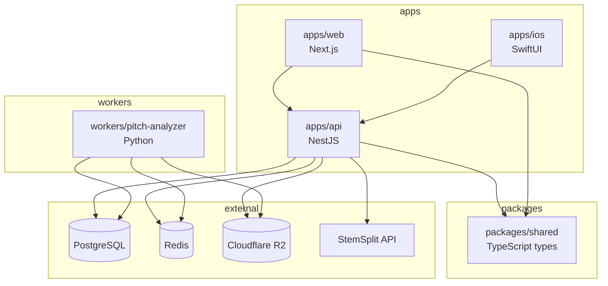

# Intonavio — Project Structure

## Monorepo Layout

```
intonavio/
├── apps/
│   ├── api/                        # NestJS backend
│   │   ├── src/
│   │   │   ├── auth/               # Apple Sign In, JWT, guards
│   │   │   ├── songs/              # Song CRUD, YouTube metadata
│   │   │   │   ├── dto/           # Request/response DTOs
│   │   │   │   └── utils/         # YouTube URL parsing
│   │   │   ├── stems/              # Stem records, R2 presigned URLs
│   │   │   │   └── dto/           # Stem response DTOs
│   │   │   ├── sessions/           # Practice session CRUD
│   │   │   │   └── dto/           # Session request/response DTOs
│   │   │   ├── jobs/               # BullMQ producers, job state
│   │   │   │   ├── adapters/      # External service adapters (StemSplit)
│   │   │   │   ├── interfaces/    # Job data types
│   │   │   │   └── processors/    # Job processors (stem-split)
│   │   │   ├── webhooks/           # StemSplit webhook handler
│   │   │   │   ├── dto/           # Webhook payload DTOs
│   │   │   │   └── guards/        # Webhook secret guard
│   │   │   ├── health/              # Health check endpoints
│   │   │   │   └── indicators/    # Prisma + Redis health indicators
│   │   │   ├── storage/            # R2 upload/download service
│   │   │   ├── common/             # Shared guards, filters, pipes
│   │   │   ├── prisma/             # Prisma service, module
│   │   │   ├── test/               # Shared test utilities
│   │   │   │   ├── test-utils.ts   # App builder, JWT generator, mock factories
│   │   │   │   └── fixtures/       # Test data (songs, webhooks)
│   │   │   ├── instrument.ts       # Sentry init (before NestJS boot)
│   │   │   └── main.ts
│   │   ├── prisma/
│   │   │   ├── schema.prisma
│   │   │   └── migrations/
│   │   ├── test/                    # E2E tests
│   │   │   ├── app.e2e-spec.ts     # Full API integration tests
│   │   │   └── jest-e2e.json
│   │   ├── Dockerfile
│   │   └── package.json
│   │
│   ├── web/                        # Next.js web client
│   │   ├── src/
│   │   │   ├── app/                # App router pages
│   │   │   ├── components/         # React components
│   │   │   │   ├── piano-roll/     # Pitch visualization
│   │   │   │   ├── youtube-player/ # YouTube embed + controls
│   │   │   │   ├── loop-controls/  # A-B loop UI
│   │   │   │   └── stem-mixer/     # Stem volume/solo/mute
│   │   │   ├── hooks/              # Custom React hooks
│   │   │   ├── lib/                # API client, audio utils
│   │   │   ├── workers/            # AudioWorklet processors
│   │   │   │   └── yin-processor.js
│   │   │   └── styles/
│   │   ├── public/
│   │   └── package.json
│   │
│   └── ios/                        # SwiftUI iOS app
│       ├── project.yml             # XcodeGen project definition
│       ├── .swiftlint.yml          # SwiftLint strict config
│       ├── Intonavio/
│       │   ├── Info.plist
│       │   ├── App/
│       │   │   ├── IntonavioApp.swift      # @main, AVAudioSession (.mixWithOthers)
│       │   │   ├── ContentView.swift       # TabView (Library, Sessions, Settings)
│       │   │   ├── AppState.swift          # @Observable: auth state, selected tab
│       │   │   └── AppTheme.swift          # Theme management (@AppStorage)
│       │   ├── Features/
│       │   │   ├── Auth/
│       │   │   │   ├── SignInView.swift         # Apple Sign In + email login
│       │   │   │   ├── SignUpView.swift          # Email registration
│       │   │   │   ├── AppleSignInButton.swift   # ASAuthorizationController wrapper
│       │   │   │   └── AuthViewModel.swift       # Sign-in/up flows
│       │   │   ├── Library/
│       │   │   │   ├── HomeView.swift            # Song grid + exercise sections
│       │   │   │   ├── AddSongSheet.swift        # YouTube URL input + submit
│       │   │   │   ├── SongGridItemView.swift    # Thumbnail, title, status badge
│       │   │   │   ├── SongStatusBadge.swift     # Color-coded processing status
│       │   │   │   ├── ExerciseBrowserView.swift # Exercise categories
│       │   │   │   ├── ExerciseSectionView.swift # Horizontal scroll section
│       │   │   │   └── LibraryViewModel.swift    # Fetch songs, add song, poll status
│       │   │   ├── Practice/
│       │   │   │   ├── SongPracticeView.swift              # YouTube video + piano roll + controls
│       │   │   │   ├── ExercisePracticeView.swift          # Exercise practice: metronome + piano roll + scoring
│       │   │   │   ├── ExercisePracticeViewModel.swift     # Exercise playback timer, pitch detection, scoring
│       │   │   │   ├── PracticeViewModel.swift             # Playback state, loop machine, transpose, sync
│       │   │   │   ├── PracticeViewModel+Audio.swift       # Audio mode switching (pause-switch-resume)
│       │   │   │   ├── PracticeViewModel+Loop.swift        # A-B loop check task
│       │   │   │   ├── PracticeViewModel+Pitch.swift       # Pitch detection lifecycle, jump filter, transpose
│       │   │   │   ├── PracticeLayoutMode.swift            # Enum: lyricsFocused (65/35), pitchFocused (25/75)
│       │   │   │   ├── ControlsBarView.swift               # Timeline + transport + source/loop + speed + transpose
│       │   │   │   ├── PlaybackControlsView.swift          # Skip back, play/pause, skip forward
│       │   │   │   ├── LoopControlsView.swift              # A/B markers, clear loop, loop count
│       │   │   │   ├── TimelineBarView.swift               # Scrubber with A/B markers
│       │   │   │   ├── SpeedSelectorView.swift             # 0.25x–2.0x discrete speed steps
│       │   │   │   ├── LoopState.swift                     # Enum: idle, playing, settingA, settingAB, looping, paused
│       │   │   │   └── PianoRoll/
│       │   │   │       ├── PianoRollView.swift             # Container: mode selector, piano keys, canvas, current note
│       │   │   │       ├── PianoRollCanvas.swift           # SwiftUI Canvas: grid, reference, detected pitch, browsing indicators
│       │   │   │       ├── PianoRollRenderer.swift         # Static draw helpers: zones, lines, glow, transposeOffset
│       │   │   │       ├── PianoRollGestureState.swift     # @Observable browsing state: phase, offset, displayTime
│       │   │   │       ├── PianoRollGestureOverlay.swift   # Touch/drag/long-press gesture overlay with state machine
│       │   │   │       ├── PianoRollMomentumEngine.swift   # Timer-based deceleration for momentum scrolling
│       │   │   │       ├── CurrentNoteView.swift           # Large note name + cents deviation indicator
│       │   │   │       ├── DetectedPitchPoint.swift        # Struct: time, midi, accuracy, cents
│       │   │   │       ├── PitchDebugOverlay.swift         # DEBUG: Hz, confidence, MIDI, FPS, scoring
│       │   │   │       └── VisualizationMode.swift         # Enum: zonesLine, twoLines, zonesGlow
│       │   │   ├── Sessions/
│       │   │   │   ├── SessionHistoryView.swift  # List with infinite scroll
│       │   │   │   ├── SessionDetailView.swift   # Score, duration, loop points
│       │   │   │   ├── SessionRowView.swift      # Date, song, duration, score
│       │   │   │   └── SessionsViewModel.swift   # Fetch + paginate sessions
│       │   │   └── Settings/
│       │   │       ├── SettingsView.swift         # Account, audio, theme, about
│       │   │       ├── SettingsViewModel.swift    # Account management
│       │   │       ├── ProfileView.swift          # Read-only profile display
│       │   │       └── DeveloperView.swift        # Debug tools (dev builds only)
│       │   ├── Audio/
│       │   │   ├── AudioEngine.swift      # Shared AVAudioEngine: VP/AEC, lifecycle, input taps
│       │   │   ├── StemPlayer.swift        # Stem playback nodes on shared AudioEngine
│       │   │   ├── StemDownloader.swift    # Presigned URL fetch + cache to disk
│       │   │   ├── VideoAudioSync.swift    # YouTube-as-master sync (300ms/2s)
│       │   │   ├── AudioMode.swift         # Enum: original, vocalsOnly, instrumental
│       │   │   ├── MetronomeTick.swift     # Click sound on shared AudioEngine
│       │   │   └── Pitch/
│       │   │       ├── AudioSessionManager.swift     # AVAudioSession: .voiceChat (AEC), interruptions
│       │   │       ├── PitchTypes.swift              # PitchResult, PitchConstants (thresholds, RMS, jump)
│       │   │       ├── NoteMapper.swift              # Hz↔MIDI↔cents conversions
│       │   │       ├── YINDetector.swift             # 5-step YIN with Accelerate vDSP
│       │   │       ├── PitchDetector.swift           # @Observable: mic tap on shared AudioEngine, ring buffer
│       │   │       ├── DifficultyLevel.swift          # Enum: beginner/intermediate/advanced — thresholds, points, zone defs
│       │   │       ├── PitchAccuracy.swift           # Enum: excellent/good/fair/poor/unvoiced — classify(cents:difficulty:)
│       │   │       ├── ScoringEngine.swift           # Cents comparison + transpose offset + score accumulation
│       │   │       ├── TransposeInterval.swift       # Enum: musical intervals (-24 to +24 semitones)
│       │   │       ├── ReferencePitchFrame.swift     # Codable frame struct matching pYIN output
│       │   │       ├── ReferencePitchStore.swift     # O(1) frame lookup by time, range queries
│       │   │       ├── PitchDataDownloader.swift     # R2 presigned URL fetch + cache
│       │   │       ├── ExercisePitchGenerator.swift  # Client-side reference from exercise definitions
│       │   │       ├── ExerciseDefinitions.swift     # Bundled scales, arpeggios, intervals
│       │   │       └── PitchRecorder.swift           # DEBUG: raw mic + detected pitch to disk
│       │   ├── YouTube/
│       │   │   ├── YouTubePlayerView.swift      # SwiftUI WKWebView wrapper
│       │   │   ├── YouTubePlayerController.swift # Playback control via JS bridge
│       │   │   ├── YouTubeBridge.swift           # WKScriptMessageHandler (ytEvent)
│       │   │   ├── YouTubeHTML.swift             # IFrame API HTML template
│       │   │   ├── YouTubeLocalServer.swift      # WKURLSchemeHandler for local HTML
│       │   │   ├── VideoPlayerProtocol.swift     # Protocol for player abstraction
│       │   │   └── WebViewPrewarmer.swift        # Pre-warm WKWebView with canvas keep-alive
│       │   ├── Networking/
│       │   │   ├── APIClientProtocol.swift  # Protocol for all API endpoints
│       │   │   ├── APIClient.swift          # URLSession implementation, auto 401 refresh
│       │   │   ├── APIEndpoint.swift        # Endpoint enum (path, method, body)
│       │   │   ├── APIError.swift           # Backend error shape
│       │   │   ├── TokenManager.swift       # Keychain JWT storage
│       │   │   ├── MockAPIClient.swift      # Fixture data for previews/tests
│       │   │   └── Models/
│       │   │       ├── AuthModels.swift          # AuthResponse, AuthUser, request DTOs
│       │   │       ├── SongModels.swift          # SongResponse, StemResponse, enums
│       │   │       ├── SessionModels.swift       # SessionResponse, CreateSessionRequest
│       │   │       └── PaginatedResponse.swift   # Generic PaginatedResponse<T>
│       │   └── Utilities/
│       │       ├── Logger.swift              # os.Logger wrapper (AppLogger)
│       │       ├── DriftLogger.swift         # Debug-build sync drift logging
│       │       └── YouTubeURLValidator.swift # YouTube URL regex validation
│       ├── IntonavioTests/
│       │   ├── Audio/
│       │   │   ├── StemPlayerTests.swift
│       │   │   ├── VideoAudioSyncTests.swift
│       │   │   ├── YINDetectorTests.swift
│       │   │   ├── NoteMapperTests.swift
│       │   │   ├── ScoringEngineTests.swift
│       │   │   ├── ExercisePitchGeneratorTests.swift
│       │   │   └── ReferencePitchStoreTests.swift
│       │   ├── Auth/
│       │   │   └── AuthViewModelTests.swift
│       │   ├── Library/
│       │   │   └── LibraryViewModelTests.swift
│       │   ├── Networking/
│       │   │   ├── APIClientTests.swift
│       │   │   └── CodableModelTests.swift
│       │   ├── Sessions/
│       │   │   └── SessionsViewModelTests.swift
│       │   └── Utilities/
│       │       └── YouTubeURLValidatorTests.swift
│       └── Intonavio.xcodeproj        # Generated by XcodeGen
│
├── packages/
│   └── shared/                     # Shared TypeScript types
│       ├── src/
│       │   ├── types.ts            # Song, Stem, Session types
│       │   ├── enums.ts            # SongStatus, StemType
│       │   └── pitch.ts            # Pitch data format types
│       └── package.json
│
├── workers/
│   └── pitch-analyzer/             # Python pitch analysis worker
│       ├── src/
│       │   ├── __init__.py         # Package marker (empty)
│       │   ├── config.py           # pydantic-settings env config
│       │   ├── logger.py           # Structured JSON logging
│       │   ├── models.py           # Pydantic models (job data, output)
│       │   ├── consumer.py         # BullMQ Worker wrapper + heartbeat
│       │   ├── analyzer.py         # pYIN pitch extraction via librosa
│       │   ├── sentry_setup.py     # Sentry init + job exception capture
│       │   ├── storage.py          # R2 download/upload via boto3
│       │   ├── db.py               # PostgreSQL upserts via psycopg2
│       │   └── worker.py           # Job orchestrator + main()
│       ├── tests/
│       │   ├── conftest.py         # Shared fixtures (config, wav gen)
│       │   ├── test_analyzer.py    # pYIN extraction tests (19 tests)
│       │   ├── test_config.py      # Config validation tests
│       │   ├── test_db.py          # DB adapter tests (mocked)
│       │   ├── test_models.py      # Pydantic model tests
│       │   ├── test_storage.py     # R2 adapter tests (mocked)
│       │   └── test_worker.py      # Orchestrator integration tests
│       ├── requirements.txt
│       ├── requirements-dev.txt
│       ├── Dockerfile
│       └── pyproject.toml
│
├── docs/                           # This documentation
│   ├── 01-overview.md
│   ├── ...
│   └── 16-ui-views-flow.md
│
├── docker-compose.dev.yml          # Local dev: PostgreSQL + Redis only
├── docker-compose.prod.yml         # Production: all services
├── turbo.json                      # Turborepo config
├── package.json                    # Root package.json
├── pnpm-workspace.yaml
└── .github/
    ├── ISSUE_TEMPLATE/
    │   ├── bug_report.md
    │   └── feature_request.md
    └── workflows/
        ├── ci.yml                  # Lint + test on every PR
        ├── deploy.yml              # Build images + deploy to production
        └── backup.yml              # Scheduled DB backup to R2
```

---

## Package Dependency Graph



---

## Tech Stack Per Directory

| Directory                | Language    | Runtime             | Key Dependencies                                                |
| ------------------------ | ----------- | ------------------- | --------------------------------------------------------------- |
| `apps/api`               | TypeScript  | Node.js 20          | NestJS, Prisma, BullMQ, `@aws-sdk/client-s3` (R2)               |
| `apps/web`               | TypeScript  | Node.js 20          | Next.js 14, React 18, Tailwind CSS                              |
| `apps/ios`               | Swift       | iOS 17+ / macOS 14+ | SwiftUI, AVFoundation, WebKit                                   |
| `packages/shared`        | TypeScript  | —                   | Zod (validation), shared types                                  |
| `workers/pitch-analyzer` | Python 3.11 | —                   | librosa, numpy, boto3 (R2), psycopg2, bullmq, pydantic-settings |

---

## Build & Development

### Turborepo Tasks

```json
{
  "pipeline": {
    "build": { "dependsOn": ["^build"] },
    "dev": { "cache": false, "persistent": true },
    "lint": {},
    "test": { "dependsOn": ["build"] },
    "db:push": { "cache": false },
    "db:generate": { "cache": false }
  }
}
```

### Common Commands

| Command            | Description                    |
| ------------------ | ------------------------------ |
| `pnpm dev`         | Start API + Web in dev mode    |
| `pnpm build`       | Build all TypeScript packages  |
| `pnpm lint`        | Lint all packages              |
| `pnpm test`        | Run all tests                  |
| `pnpm db:push`     | Push Prisma schema to database |
| `pnpm db:generate` | Generate Prisma client         |

### iOS Development

- Project managed by XcodeGen (`apps/ios/project.yml`)
- Run `cd apps/ios && xcodegen generate` after adding/removing files
- Open `apps/ios/Intonavio.xcodeproj` in Xcode
- Requires Xcode 15+ and iOS 17+ simulator or device
- SwiftLint runs as a build phase (strict: 300 lines/file, 40 lines/function)
- No Turborepo integration — developed separately in Xcode
