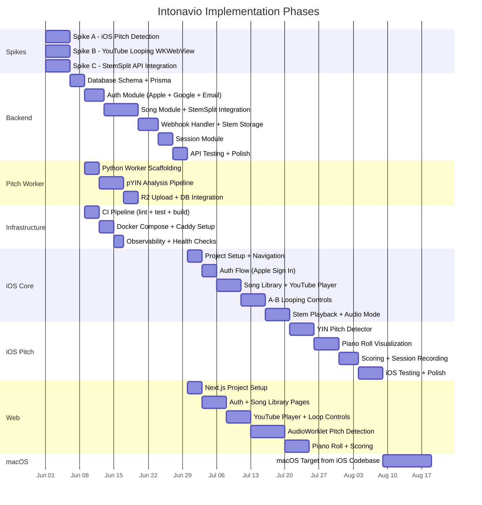
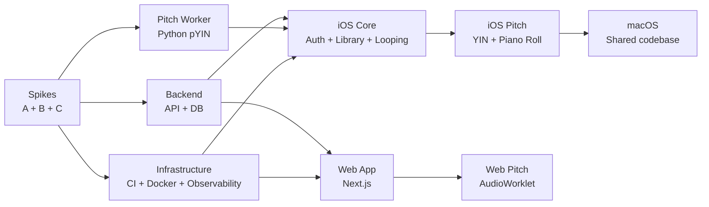

# Intonavio — Implementation Phases

## Gantt Chart

## Phase Dependency Graph

---

## Phase Details

### Phase 0: Spikes (Validation)

> See `docs/11-spikes.md` for detailed spike plans.

**Goal:** Validate the three riskiest technical assumptions before committing to full implementation.

| Spike | Question                                                         | Deliverable                                     |
| ----- | ---------------------------------------------------------------- | ----------------------------------------------- |
| A     | Can we detect pitch in real time on iOS with acceptable latency? | Working YIN prototype with latency measurements |
| B     | Can we embed YouTube in WKWebView with programmatic A-B looping? | Prototype with seek, loop, and speed control    |
| C     | Does StemSplit API meet our quality and latency needs?           | Integration test with cost and timing data      |

**Exit criteria:** All three spikes pass → proceed to Phase 1. Any spike fails → re-evaluate approach.

---

### Phase 1: Backend ✅ COMPLETE

**Goal:** Fully functional API server that handles auth, song processing, and session storage.

> **Status:** All 11 sub-phases implemented and verified. 92 unit tests + 23 e2e tests passing, lint clean, build clean. Deployed to production, verified: health check (DB + Redis up), user registration (JWT tokens), song submission (202 QUEUED). See `docs/implementation_plans/backend.md` for detailed sub-phase breakdown.

**Deliverables:**

- PostgreSQL schema deployed via Prisma migrations with CUIDs for primary keys, `onDelete` behavior on all foreign keys, and indexes for all query patterns (see `docs/12-code-quality.md` — Prisma rules)
- Auth module supporting Apple Sign In, Google OAuth, and Email/Password with JWT issuance (see `docs/02-architecture.md` — External Service Isolation for `AuthProviderService` adapter)
- Song submission → StemSplit job → webhook → R2 storage pipeline with `traceId` correlation across all steps (see `docs/13-observability.md`)
- All external services wrapped behind adapter interfaces: `StemSplitService`, `StorageService`, `AuthProviderService` (see `docs/02-architecture.md` — External Service Isolation)
- Session CRUD endpoints with pagination (`?page=1&limit=20`) on all list endpoints (see `docs/02-architecture.md` — API Contract Rules)
- BullMQ jobs are idempotent with typed data interfaces, 3 retries with exponential backoff, and structured lifecycle logging (see `docs/12-code-quality.md` — BullMQ rules)
- Controllers handle HTTP concerns only; business logic in services. One module per domain (see `docs/02-architecture.md` — Module Boundary Rules)
- Consistent error shape `{ statusCode, error, message }` on all endpoints. 4xx for client errors, 5xx for server errors (see `docs/02-architecture.md` — Error Propagation)
- Integration tests for all endpoints using supertest with mock externals (see `docs/14-testing-strategy.md` — Level 2)
- 80% line coverage minimum, 95% branch coverage on algorithmic modules (see `docs/12-code-quality.md` — Test Coverage)
- Structured JSON logging with mandatory fields: `traceId`, `module`, `durationMs` (see `docs/13-observability.md` — Structured Logging)
- Health endpoints: `GET /health` and `GET /health/detailed` (see `docs/13-observability.md` — Health Checks)
- Deployed via Docker Compose (see `docs/08-infrastructure.md`)

**Quality gates:**

- All linters pass (ESLint strict + Prettier), no warnings
- Max 300 lines per file, 40 lines per function, cyclomatic complexity ≤ 10
- No `any` types, no `console.log`, no `process.env` in services
- All webhook payloads validated against expected schema

---

### Phase 2: Pitch Worker ✅ COMPLETE

**Goal:** Python worker that extracts reference pitch from vocal stems.

> **Status:** All 8 sub-phases implemented and verified. 43 unit tests passing, ruff lint/format clean, mypy strict clean, 83% overall coverage (80% threshold), 100% coverage on `analyzer.py` (95% threshold). Deployed to production, verified on 2 songs — both transitioned from ANALYZING → READY with valid pitch data. See `docs/implementation_plans/pitch-worker.md` for detailed sub-phase breakdown.

**Deliverables:**

- BullMQ consumer (`consumer.py`) that listens on the `pitch-analysis` queue with 5-minute lock duration for CPU-bound pYIN extraction
- pYIN extraction pipeline (`analyzer.py`) with configurable parameters (fmin=65, fmax=2093, hop_length=512), all parameters logged for reproducibility (see `docs/13-observability.md` — Python Worker debugging)
- Validation: reject output if >90% of frames are unvoiced or all NaN (see `docs/12-code-quality.md` — Python rules)
- JSON pitch data upload to R2 with key `pitch/{songId}/reference.json` and `Content-Type: application/json` (see `docs/12-code-quality.md` — R2 rules)
- Database status updates (song ANALYZING → READY) via psycopg2 transactions with idempotent `ON CONFLICT DO UPDATE` upserts
- Pydantic models (`models.py`) for job payloads (camelCase aliases for BullMQ interop) and output validation
- Environment configuration (`config.py`) via pydantic-settings with fail-fast startup validation
- Structured JSON logging (`logger.py`) with mandatory fields: level, timestamp, service, module, message, traceId, songId, durationMs (see `docs/13-observability.md`)
- Stdout heartbeat every 60s for health monitoring
- Type hints on all function signatures, mypy strict mode
- Process-isolated: download stem → extract pitch → upload JSON → update DB. No shared mutable state
- 83% overall line coverage, 100% branch coverage on `analyzer.py` (pYIN extraction and MIDI math)
- Deployed as Docker container with CPU/memory limits (2 CPU, 2G RAM)

**Quality gates:**

- Ruff linting + formatting passes, mypy strict passes
- Exact dependency versions pinned in `requirements.txt`
- Job idempotency verified: `ON CONFLICT ("songId") DO UPDATE` ensures re-runs produce same result
- Verified on production: 2 songs processed (20,501 and 26,679 frames, 62.7% and 69.1% voiced)

---

### Phase 3: Infrastructure & CI/CD ✅ COMPLETE

**Goal:** Automated build/test/deploy pipeline and production infrastructure.

> **Status:** All deliverables implemented. CI workflow (lint + test + Docker build for api/web/worker), deploy workflow (builds and pushes api + worker images to ghcr.io, deploys via SSH with health checks), backup workflow (daily pg_dump to R2). Sentry error monitoring integrated in API (`@sentry/nestjs` with 5xx capture and traceId/userId tags) and worker (`sentry-sdk` with job exception capture and traceId/songId tags). Docker build contexts configured correctly for worker (uses `./workers/pitch-analyzer` context). Repo configured for squash-merge only with auto-delete branches. Branch protection rules (required status checks) require GitHub Pro for private repos — not yet enabled.

**Deliverables:**

- CI workflow (`ci.yml`): pnpm install → lint → test → coverage check → build → Docker image build (api, web, worker with correct build contexts) on every PR (see `docs/15-development-workflow.md`)
- Deploy workflow (`deploy.yml`): build api + worker images → push to ghcr.io → SSH to server → pull + up → migrate → health check on merge to `main`
- Backup workflow (`backup.yml`): daily pg_dump → R2, retain 30 days
- Docker Compose production setup with all containers: api, web, worker, postgres, redis on `stack_appnet` network (see `docs/08-infrastructure.md`)
- Caddy reverse proxy with automatic TLS
- Sentry integration for API and worker with `traceId` tags — no-op when `SENTRY_DSN` is empty (see `docs/13-observability.md` — Error Reporting)
- Coverage thresholds enforced in CI: 80% overall, 95% algorithmic, 80% new code in PR (see `docs/12-code-quality.md`)
- All linter configs: ESLint strict + sonarjs, SwiftLint strict, Ruff + mypy strict — warnings treated as errors

**Quality gates:**

- Repo configured for squash merge only, auto-delete branches on merge
- Branch protection (required CI checks before merge) pending GitHub Pro upgrade

---

### Phase 4: iOS Core ✅ COMPLETE

**Goal:** iOS app with authentication, song library, YouTube playback, A-B looping, and stem playback.

> **Status:** All 11 sub-phases implemented and verified. 58 unit tests passing, SwiftLint strict clean (0 warnings), all files under 300 lines. Xcode project managed via XcodeGen (`project.yml`). Deployed to device, verified: Apple Sign In, song add + processing, YouTube playback with A-B looping, stem download + vocals/instrumental switching, session auto-save. See `docs/implementation_plans/ios-core.md` for detailed sub-phase breakdown.

**Deliverables:**

- SwiftUI app with 3-tab navigation (Library, Sessions, Settings), MVVM architecture (see `docs/12-code-quality.md` — SwiftUI rules, `docs/16-ui-views-flow.md`)
- XcodeGen-managed project (`project.yml`) with development team, Info.plist keys, and signing all persisted across regenerations
- `@Observable` macro (iOS 17+) for all ViewModels, not `ObservableObject`
- Auth views: Sign In (Apple/Email) and Sign Up. Google Sign In deferred (requires SDK + web redirect)
- Home view with song library grid + exercises placeholder section
- Add Song sheet with YouTube URL validation and processing progress polling
- Apple Sign In integration with backend JWT via `APIClientProtocol` (protocol-oriented for testability)
- Token refresh flow: intercept 401 → refresh → retry once → on failure clear Keychain + sign out
- YouTube player in WKWebView with JS bridge via `VideoPlayerProtocol` adapter, served from local NWListener HTTP server
- WKWebView pre-warming at app launch via shared `WKProcessPool` with canvas keep-alive page to prevent GPU/WebContent IdleExit
- A-B loop controls with draggable markers on timeline (translation-based drag to prevent feedback loops)
- Stem playback via AVAudioEngine graph: `AVAudioPlayerNode` per stem → `AVAudioMixerNode` → `AVAudioUnitTimePitch` → output
- Three audio source buttons inline in controls bar: speaker (YouTube original), mic (vocals only), guitars (instrumental only)
- `AVAudioSession` configured with `.playAndRecord`, `.measurement`, `.mixWithOthers` to prevent YouTube/AVAudioEngine interruption conflicts
- `StemPlayer` with automatic engine restart on audio session interruption via `ensureEngineRunning()`
- Pause-switch-resume pattern for audio mode transitions to prevent sync race conditions
- Video-audio sync: YouTube is master clock, stems follow. 300ms drift threshold, 2s poll interval (see `docs/07-youtube-looping.md`)
- Stem download with local cache (`Caches/stems/{songId}/`) — persists across app launches
- Session auto-save on practice exit after 10s+ of playback
- Loading overlay ("Preparing player...") shown until YouTube IFrame fires `onReady`
- DEBUG-only Developer Tools screen in Settings: API status, token inspection, quick add song, force refresh
- `Codable` structs mirroring API response shapes, no manual JSON parsing
- `async/await` and `Task` for all async work, tasks cancelled when views disappear
- SwiftUI previews for every view with mock data
- Network request logging in debug builds via `os.Logger` wrappers

**Quality gates:**

- SwiftLint strict passes, no warnings (file_length: 300, function_body_length: 40, type_body_length: 200, cyclomatic_complexity: 10, nesting: 3)
- 58 unit tests: APIClient, Codable models, Auth, Library, YouTube URL validator, StemPlayer, VideoAudioSync, Sessions
- No `print()` — all logging via `AppLogger` (`os.Logger` subsystem)
- Audio thread safety: `installTap` callback — no allocation, no locks, no UI updates

---

### Phase 5: iOS Pitch ✅ COMPLETE

**Goal:** Real-time pitch detection, piano roll visualization, and scoring.

> **Status:** All 8 sub-phases implemented and verified. 129 unit tests passing (71 new pitch tests), build clean. All files under 300 lines. Audio session uses `.voiceChat` mode for echo cancellation. Pre-detection filtering: RMS noise gate (Accelerate vDSP), confidence threshold 0.85, MIDI jump filter (>12 semitones in <50ms). Reference pitch transpose support (±2 octaves via musical intervals). See `docs/implementation_plans/ios-pitch.md` for detailed sub-phase breakdown.

**Deliverables:**

- YIN pitch detector running on microphone input via dedicated `AVAudioEngine` (coexists with StemPlayer)
- `AudioSessionManager` with `.voiceChat` mode for built-in Acoustic Echo Cancellation — prevents speaker bleed into mic
- Pre-detection filtering: RMS noise gate via `vDSP_rmsqv` (skip if <0.01 / ~-40 dB), confidence threshold 0.85, MIDI jump filter rejecting >12 semitone jumps within 50ms
- Unit tests: known sine waves (440Hz, 261.63Hz, 329.63Hz) → detected within ±1 Hz; silence → no detection; noise → low confidence
- Song Practice view with toggleable layout: lyrics-focused (65/35) and pitch-focused (25/75) (see `docs/16-ui-views-flow.md`)
- Exercise Practice view with pitch graph, target notes, metronome tick, and tempo guide
- Piano roll view with 3 visualization modes: Zones+Line, Two Lines, Zones+Glow (see `docs/16-ui-views-flow.md`)
- Interactive piano roll gestures: touch-to-pause, swipe-to-scrub with momentum deceleration, long-press-to-loop-phrase. Browsing mode decouples displayed time from playback with visual indicators (dashed playhead, dimmed playback position line). See `docs/16-ui-views-flow.md` — Piano Roll Touch Gestures.
- Color-coded accuracy feedback with 3 difficulty levels (Beginner/Intermediate/Advanced) — zone widths and point values scale per level (see `docs/06-realtime-pitch.md`). Default is Beginner. Difficulty picker in Settings with visual zone preview. Best scores tracked per difficulty level via `ScoreRecord.difficulty` field.
- Reference pitch transpose: shift reference up/down by musical intervals (-2 oct to +2 oct) via `TransposeInterval` enum, applied to both visual rendering (reference zones/lines) and scoring (cents calculation). User's detected voice remains at actual position. Controlled via transpose picker menu in `ControlsBarView`.
- Per-session scoring: cents deviation calculation with transpose offset and division-by-zero protection for unvoiced frames
- `ScoringEngine` with `transposeSemitones` — adjusts reference frequency via `refHz × 2^(semitones/12)` before comparison
- Session recording and review with `pitchLog` JSON for debug reproducibility (see `docs/13-observability.md`)
- Pitch detection debug mode (dev settings toggle): records raw mic input + detected frequencies for "scoring feels wrong" reports
- `PracticeViewModel+Loop.swift` extracted from main ViewModel to stay under 300-line limit
- 129 total tests passing including transpose scoring tests (octave up/down, mismatch detection, adjusted reference logging)

**Quality gates:**

- Scoring math: `(440, 440) → 0 cents`, `(440, 466.16) → 100 cents`, `(440, 220) → -1200 cents` all pass
- Transpose scoring: octave up (440→880 ref) → 100 score with 880Hz detected; mismatch → poor accuracy
- Exercise pitch generator: vibrato oscillation within ±cents, rest periods produce `hz: null`
- Echo cancellation: song playing through speaker does not produce detected pitch when user is silent
- 129 tests, 0 failures

---

### Phase 6: Web App

**Goal:** Browser-based version with feature parity to iOS.

**Deliverables:**

- Next.js app with Server Components by default, `"use client"` only for browser API components (see `docs/12-code-quality.md` — Next.js rules)
- Authentication (web-based Apple Sign In, Google OAuth, or email) via route handler BFF proxying API calls with server-side auth tokens
- Song library and YouTube player pages with A-B loop controls
- AudioWorklet-based pitch detection — processor in standalone `.js` file in `/public`, not bundled
- Audio objects (`AudioContext`, `MediaStream`, nodes) in `useRef`, not `useState`
- `useEffect` cleanup: stop media streams, close audio contexts, disconnect nodes on unmount
- Piano roll visualization (Canvas) with frame drop detection (warn if <30fps) (see `docs/13-observability.md` — Web Client debugging)
- Scoring and session history
- AudioWorklet errors explicitly forwarded to main thread for error reporting (Sentry browser SDK)
- `performance.mark()` / `performance.measure()` around pitch detection cycle
- No `any` in component props — explicit prop interfaces
- 70% line coverage minimum, 95% branch coverage on pitch detection and scoring
- Deployed as Docker container behind Caddy (see `docs/08-infrastructure.md`)

**Quality gates:**

- ESLint strict + sonarjs + Prettier passes, no warnings
- Max 150 lines per component, 300 lines per file
- E2E tests (Playwright): sign in → submit URL → READY, play + loop, practice + score (see `docs/14-testing-strategy.md` — Level 4)

---

### Phase 7: macOS

**Goal:** macOS app derived from the iOS codebase.

**Deliverables:**

- macOS target in the Xcode project
- UI adaptations for larger screen (sidebar navigation, resizable piano roll)
- Keyboard shortcuts for looping and playback control (see `docs/07-youtube-looping.md` — shortcuts)
- Same code quality standards as iOS: SwiftLint strict, MVVM, `@Observable`, previews
- Mac App Store submission
