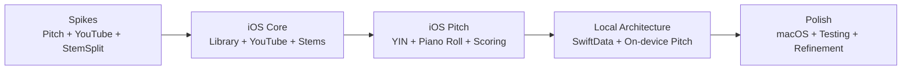

# IntonavioLocal — Implementation Phases

## Phase Dependency Graph

---

## Phase Details

### Phase 0: Spikes (Validation)

> See `docs/11-spikes.md` for detailed spike plans and results.

**Goal:** Validate the three riskiest technical assumptions before committing to full implementation.

| Spike | Question                                                         | Result    |
| ----- | ---------------------------------------------------------------- | --------- |
| A     | Can we detect pitch in real time on iOS with acceptable latency? | PASS      |
| B     | Can we embed YouTube in WKWebView with programmatic A-B looping? | PASS      |
| C     | Does StemSplit API meet our quality and latency needs?           | PASS (conditional) |

**Exit criteria:** All three spikes passed. Proceeded to implementation.

---

### Phase 1: iOS Core (COMPLETE)

**Goal:** iOS app with song library, YouTube playback, A-B looping, and stem playback. Originally built against a backend API server.

**Deliverables:**

- SwiftUI app with 3-tab navigation (Library, Sessions, Settings), MVVM architecture
- XcodeGen-managed project (`project.yml`)
- `@Observable` macro (iOS 17+) for all ViewModels
- Song library with YouTube URL submission and processing progress
- YouTube player in WKWebView with JS bridge via `VideoPlayerProtocol` adapter
- WKWebView pre-warming at app launch via shared `WKProcessPool`
- A-B loop controls with draggable markers on timeline
- Stem playback via shared `AudioEngine`: `AVAudioPlayerNode` per stem -> `AVAudioMixerNode` -> `AVAudioUnitTimePitch` -> output
- Three audio source buttons: speaker (full mix), mic (vocals only), guitars (instrumental only)
- Video-audio sync: YouTube is master clock, stems follow. 300ms drift threshold, 2s poll interval
- Stem download with local cache
- Session auto-save on practice exit after 10s+ of playback

---

### Phase 2: iOS Pitch (COMPLETE)

**Goal:** Real-time pitch detection, piano roll visualization, and scoring.

**Deliverables:**

- YIN pitch detector running on microphone input via shared `AudioEngine`
- Audio session with echo cancellation (AEC)
- Pre-detection filtering: RMS noise gate, confidence threshold 0.85, MIDI jump filter
- Song Practice view with toggleable layout: lyrics-focused (65/35) and pitch-focused (25/75)
- Exercise Practice view with pitch graph, target notes, metronome tick, and tempo guide
- Piano roll with 3 visualization modes: Zones+Line, Two Lines, Zones+Glow
- Interactive piano roll gestures: touch-to-pause, swipe-to-scrub with momentum, long-press-to-loop-phrase
- Color-coded accuracy feedback with 3 difficulty levels (Beginner/Intermediate/Advanced)
- Reference pitch transpose: shift reference up/down by musical intervals
- Per-session scoring with cents deviation calculation
- Session recording and review with `pitchLog` JSON

---

### Phase 3: Local Architecture (COMPLETE)

**Goal:** Remove backend server dependency. All processing and storage on-device.

**Deliverables:**

- **SwiftData models** replacing Prisma/PostgreSQL: `SongModel`, `StemModel`, `SessionModel`, `ScoreRecord` with cascade deletes and unique constraints
- **StemSplitService** (direct URLSession calls) replacing backend API proxy: job creation, status polling (15s intervals, 10 min max), parallel stem download
- **YouTubeMetadataService** using YouTube oEmbed API for song metadata
- **SongProcessingService** orchestrating the full pipeline as a single async Task: metadata fetch -> StemSplit job -> poll -> download stems -> pitch analysis -> ready
- **PitchAnalyzer** for on-device batch YIN pitch extraction from vocal stems using Accelerate/vDSP
- **Phrase detection** identifying contiguous vocal regions with gap merging and short phrase filtering
- **LocalStorageService** managing Documents directory paths for stems and pitch data
- **KeychainService** for secure StemSplit API key storage (user-provided)
- **ScoreRepository** for per-song and per-phrase best score tracking
- Removed: NestJS API, PostgreSQL, Redis, BullMQ, Python worker, Docker, Caddy, auth system, Prisma
- No user accounts, no authentication, no cloud storage

---

### Phase 4: Polish & macOS

**Goal:** macOS target, test coverage, UI refinement.

**Deliverables:**

- macOS target in XcodeGen project sharing iOS codebase
- `NavigationSplitView` sidebar navigation on macOS vs `TabView` on iOS
- macOS entitlements: sandbox, network client/server, audio input
- Split Spectrum design language (dark-mode-only "Voice Cockpit" aesthetic)
- Guide tone settings with configurable instrument (SoundFont-based)
- Storage usage display in Settings
- Developer tools (DEBUG only)
- Unit tests for pitch detection, scoring, SwiftData models, services

---

### Phase 5: Future (Planned)

**Potential deliverables:**

- Mac App Store submission
- Community exercise sharing (would require a lightweight backend)
- Additional vocal exercises
- Performance optimizations for longer songs
- iPad-optimized layout
